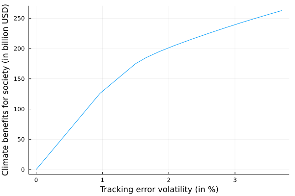

# Climate Investing

We now turn to the use of climate costs for passive management (optimized portfolio)

## Benchmark Climate Costs

Let's first create a struct `Benchmark` to store the main information we have:
```julia
Base.@kwdef mutable struct Benchmark
    b::Vector{Float64} # benchmark weights
    c::Vector{Float64} # Climate costs per $ mv
    σ::Vector{Float64} # Volatility 
    ρ::Matrix # Correlation matrix
    Σ::Union{Matrix,Nothing} = nothing # Covariance Matrix
end


our_benchmark = Benchmark(b = [0.23, 0.19, 0.17, 0.13, 0.09, 0.08, 0.06, 0.05],
                        c= [0.06, 0.8, 0.39, 0.01, 0.05, 0.13, 0.5, 0.45],
                        σ = [0.22, 0.20, 0.25, 0.18, 0.35, 0.23, 0.13, 0.29],
                        ρ = ρ)
```

Given the Climate costs per $ mv and the respective weights for each issuer, how to compute the benchmark associated climate costs? 

We have:

$C^{costs}(b) = \sum^8_{i=1}b_i c^{costs}_i*MV$

$=b^TC^{costs}*MV$

Where $C^{costs}$ is the climate costs associated with the benchmark, $b$ is the vector of weights of the benchmark, $c^{costs}$ is the climate costs per of market value and $MV$ is the overall market value of the benchmark.

Let's implement it in Julia:
```julia
function get_benchmark_climate_costs(bench::Benchmark, mv::Int)::Float64
    return - round(bench.b' * bench.c * mv; digits= 2)
end

get_benchmark_climate_costs(our_benchmark, 1000) # suppose the MV of the benchmark is 1000 billions of USD
```

The output is:
```
-300.8
```

Which means that the benchmark climate negative externalities amount 300.8 billion USD!

## Climate Benefits to Society

Having the previous benchmark, let's assume a portfolio with the same issuers than the benchmark, but different weights $x$. How can we compare the relative performance of the tilted portfolio compared to the benchmark? 

We can compute the "climate benefits to society", meaning the avoided climate-related costs with the portfolio:

$C^{benefits} = - (x-b)^T c * MV$

```julia
Base.@kwdef mutable struct TiltedPortfolio
    x::Vector{Float64} # Optimal weights
end

other_portfolio = TiltedPortfolio(x = [0.30, 0.10, 0.08, 0.02, 0.48, 0.01, 0.005, 0.0055])

function get_climate_benefits(portfolio::TiltedPortfolio, bench::Benchmark, mv::Int)::Float64 
    return -1 * round((portfolio.x - bench.b)' * bench.c * mv;digits = 5)
end

get_climate_benefits(other_portfolio, our_benchmark,1000)
```

Which gives:
```
141.125
```

It means that investing in the tilted portfolio defined previously allows to reduce by 141 billion USD the climate-related costs!

## Climate Benefits vs. Tracking Error Control: The Efficiency Frontier

An interesting arbitrage to evaluate is the one regarding maximizing climate benefits for society while minimizing the tracking error control. We will then draw the corresponding efficiency frontier.

### Tracking Error Volatility

The tracking error volatility can be computed such as:

$\sigma(x|b) = \sqrt{(x-b)^T\Sigma(x-b)}$

```julia
using LinearAlgebra
function get_cov_from_corr!(bench::Benchmark)::Benchmark
    D = diagm(bench.σ) # diagonal matrix of volatiltiy
    bench.Σ = D * bench.ρ * D # multiplying columns and rows of correlation matrix by volatiltiy
    return bench
end

get_cov_from_corr!(our_benchmark)

function tracking_error_volatility(portfolio::TiltedPortfolio, bench::Benchmark)::Float64
    return sqrt((portfolio.x - bench.b)' * bench.Σ * (portfolio.x - bench.b))
end 
```

### Tracking Error Control

The objective function is

$x^*(\gamma) = argmin \frac{1}{2}x^T\Sigma x-x^T(\gamma * -c +\Sigma b)$
(ie. the efficient portfolio must reduce the climate-related costs while minimizing the tracking error volatility compared to the benchmark, with respect to the $\gamma$ parameter or risk aversion parameter).

- The constraints are simply:
  - $1^Tx=1$ (ie. the weights must sum to one)
  - $0\leq x \leq 1$ (ie. the weights must be between 0 and 1)

```julia
using JuMP, COSMO # for the optimization


# tilt the benchmark according to gamma
function portfolio_tilting(bench::Benchmark, γ::Float64)::TiltedPortfolio
    n = length(bench.c) # number of assets
    model = JuMP.Model(COSMO.Optimizer)
    # the optimal weights we want to find
    @variable(model, x[1:n])
    @objective(model, Min, 1/2 * x' * bench.Σ * x - x' * (γ * -1 * bench.c + bench.Σ * bench.b))
    @constraint(model, zeros(n) .<= x .<= ones(n))
    @constraint(model, ones(n)' * x == 1)
    JuMP.optimize!(model)
    portfolio = TiltedPortfolio(x = JuMP.value.(x))
    return portfolio
end


# simulate for gammas between 0 and 10
using Plots
gammas = [i for i in 0.0:0.001:0.012]
climate_benefits = zeros(length(gammas))
excess_te = zeros(length(gammas))

for i in 1:length(gammas)
    new_portfolio = portfolio_tilting(our_benchmark, gammas[i])
    climate_benefits[i] = get_climate_benefits(new_portfolio, our_benchmark, 1000) # suppose 1000 billion of MV for the benchmark
    excess_te[i] = tracking_error_volatility(new_portfolio, our_benchmark) * 100
end


plot(excess_te, climate_benefits, xlabel = "Tracking error volatility (in %)",
                                ylabel = "Climate benefits for society (in billion USD)",
                                label = "")
```

