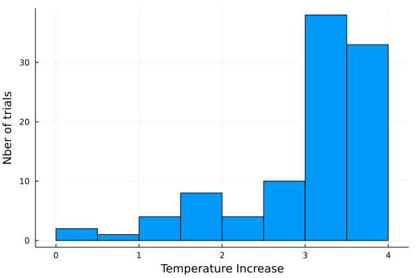
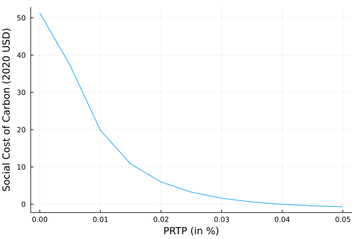

# Climate Uncertainty

- Climate costs valuation is associated with various sources of parameters uncertainties and scenarios:
    - scenarios of population projection
    - scenarios of technology
    - scenarios of economics dynamics 
    - atmospheric chemistry
    - climate dynamics
    - impacts

## Parameters Uncertainty

Let's illustrate this uncertainty by conducting a Monte Carlo simulation on the climate sensitivity parameter:

```julia
using Mimi 
using MimiFUND
using Plots
using Statistics
using Distributions

# get the model 
m = MimiFUND.get_model()
run(m)
explore(m)

sd = @defsim begin 
    # Define random variables 
    climatedynamics.climatesensitivity = truncated(Normal(2, 1), 0.1, 5) # truncated to be stricly positive
    save(climatedynamics.temp)
end

# Run 100 trials 
si = run(sd, m, 100)

test = getdataframe(si, :climatedynamics, :temp)

test = filter("time" => ==(2100), test)

histogram(test[:,:temp], label = nothing, xlabel = "Temperature Increase", ylabel = "Nber of trials")
```



## Discount Rates

Another possible source of uncertainty is the chosen discount rate. 

```julia
using Mimi 
using MimiFUND
using Plots
using Statistics
using Distributions

# get the model 
m = MimiFUND.get_model()

update_param!(m, :climatedynamics, :climatesensitivity, 4.5)


discounting = [i for i in 0:0.005:0.05]

results_sc = []

for i in eachindex(discounting)
    push!(results_sc, MimiFUND.compute_scc(m, year = 2020, eta = 1., prtp = discounting[i]) * 1.68)
end

plot(discounting, results_sc, label = nothing, xlabel = "PRTP (in %)", ylabel = "Social Cost of Carbon (2020 USD)")
```

