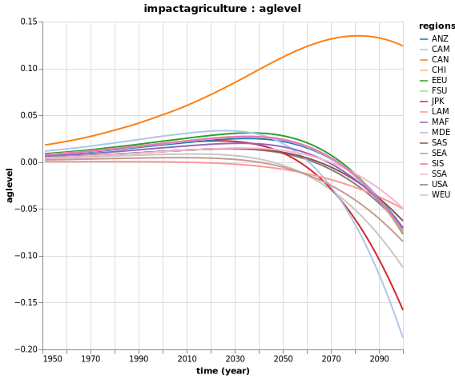
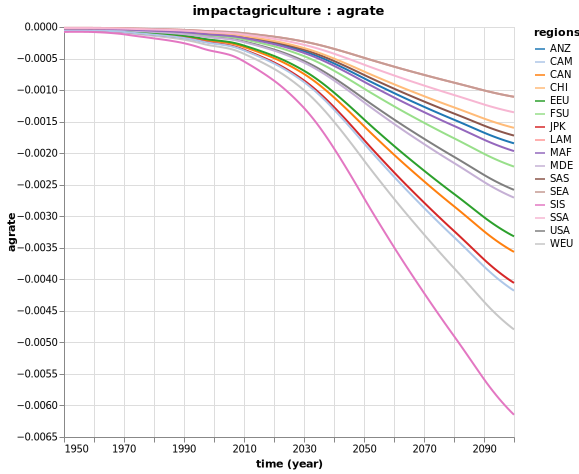
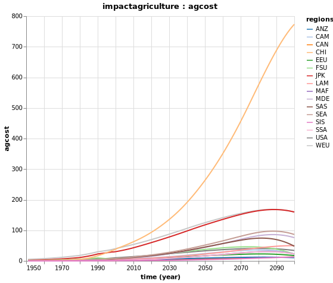

# Impacts

To decompose and assess various damages due to climate change, we will use the FUND model.

This model is a so-called Integrated Assessment Model of climate change and is often used for studying impacts of climate change in a dynamic context. 

We will focus here on the impacts valuation / decomposition.

We will use the `Mimi Framework` and the model made available as a Julia package `MimiFUND`.


## Agriculture Impacts

### Endogenous Variables 

| Notation      | Description | Equation | 
| ----------- | ----------- |----------- |
| $A^r_{t,r}$  | Impacts due to the rate of climate change | $A^r_{t,r} = \alpha_r (\frac{\Delta T_t}{0.04})^\beta + (1-\frac{1}{\rho}) A^r_{t-1,r}$ |
| $A^l_{t,r}$  | Damages in agriculture production as a fraction due to the level of climate change | $A^l_{t,r} = \delta^l_r T_t + \delta^q_r T_t^2$ |
| $A^f_{t,r}$  | CO2 fertilization impacts | $A^f_{t,r} = \frac{\gamma_r}{ln2}ln\frac{CO2_t}{275}$ |
| $A_{t,r}$  | Impacts of climate change on agriculture | $A_{t,r} = A^r_{t,r} + A^l_{t,r} + A^f_{t,r}$ |


### Parameters
| Notation      | Description |  
| ----------- | ----------- |
| $\Delta T$  | Change in the regional mean temperature (in degree Celsius) between time $t$ and $t-1$  |
| $\alpha$  | Regional change in agriculture production for an annual warming of 0.04°C  | 
| $\beta$  | Non-linearity of the reaction to temperature  | 
| $\rho$  | Speed of adaptation  | 
| $T$  | Global mean temperature above pre-industrial (in degree Celsius)  | 
| $\delta^l_r$  | Parameter for the damages function on agriculture production due to the level of climate change  | 
| $\delta^q_r$  | Parameter for the damages function on agriculture production due to the level of climate change  | 
| $CO2$  | Atmospheric concentration of carbon dioxide (in parts per million by volume)  | 
| $\gamma$  | Impacts of doubling of CO2 concentrations | 
| $\frac{GAP_{t,r}}{Y_{t,r}}$  | Share of agriculture production in total income | 

### Damages

The baseline scenario corresponds to the one with an increase of 3.5°C compared to pre-industrial level by 2100.

Now, let's run the baseline model in Julia:
```julia
using Mimi
using MimiFUND

# Run FUND for baseline scenario
m = MimiFUND.get_model()

set_dimension!(m, :time, 1950:2100) # set the timeline to be 1950 to 2100

run(m)
```
You can explore all results:
```julia
explore(m)
```
You can see the impacts associated with the level of climate change:
```julia
p = Mimi.plot(m, :impactagriculture, :aglevel)
```


The impacts of the rate of climate change:
```julia
p = Mimi.plot(m, :impactagriculture, :agrate)
```


And, finally, the overall expected impacts on agriculture:
```julia
p = Mimi.plot(m, :impactagriculture, :agcost)
```



## Ecosystems Impacts

## Energy Consumption Impacts

## Forestry Impacts

## Sea Level Rise Impacts

## Mortality Impacts

## Human Health Impacts

## Extreme Weather Impacts

## Water Resources Impacts
