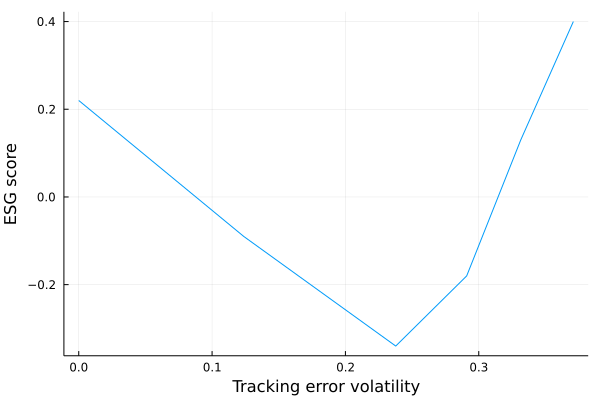

# QP Problem for Tilted Portfolios

## Portfolio ESG Score

Let's first create a struct `Benchmark` to store the main informations we have:
```julia
Base.@kwdef mutable struct Benchmark
    μ::Vector{Float64} # Expected returns 
    b::Vector{Float64} # benchmark weights
    s::Vector{Float64} # ESG Score
    Σ::Matrix # Covariance Matrix
end

Σ = [ 0.1536  0.006  0.0108  0.0156  0.024
0.006   0.17   0.018   0.026   0.04
0.0108  0.018  0.1324  0.0468  0.072
0.0156  0.026  0.0468  0.1776  0.104
0.024   0.04   0.072   0.104   0.28]

our_benchmark = Benchmark(μ = [0.03,0.04,0.05,0.07,0.1],
                        b = [0.2, 0.2, 0.2, 0.2, 0.2],
                        s= [1.1,2.7,-0.9,-2.2,0.4], 
                        Σ = Σ)
```

Given the ESG scores and the respective weights for each issuer, how to compute the benchmark ESG score?

We have:

$S^{esg}(b) = \sum^5_{i=1}b_iS^{esg}_i$

$= b^TS^{esg}$

Let's implement it in Julia:
```julia
function get_benchmark_score(bench::Benchmark)::Float64
    return round(bench.b' * bench.s; digits= 2)
end

get_benchmark_score(our_benchmark) 
```
and the result is:
```
0.22
```

## Excess Expected Returns and Tracking Error Volatility

Having the previous benchmark, let's assume a portfolio with the same issuers than the benchmark, but different weights $x$. 
How can we compare the relative performance of the tilted portfolio compared to the benchmark? 

We will compute first the excess expected returns:

$\mu(x|b) = (x - b)^T \mu$

and then the tracking error volatility:

$\sigma(x |b) = \sqrt{(x-b)^T\Sigma(x-b)}$

Let's implement this:
```julia

Base.@kwdef mutable struct TiltedPortfolio
    x::Vector{Float64} # Optimal weights
end

portfolio = TiltedPortfolio(x = [0.1, 0.1, 0.3, 0.3, 0.2])


function get_excess_returns(portfolio::TiltedPortfolio, bench::Benchmark)::Float64 
    return round((portfolio.x - bench.b)' * bench.μ;digits = 5)
end


function tracking_error_volatility(portfolio::TiltedPortfolio, bench::Benchmark)::Float64
    return sqrt((portfolio.x - bench.b)' * bench.Σ * (portfolio.x - bench.b))
end
```
Let's find first the excess expected returns:
```julia
get_excess_returns(portfolio, our_benchmark)
```
which returns:
```
0.005
```
and then the tracking error volatiltiy:
```julia
tracking_error_volatility(portfolio, our_benchmark)
```
which gives:
```
0.07735631842325487
```


## Standard QP Problem
Recall that the formulation of a standard QP problem is:

$\begin{equation*}
\begin{aligned}
& x^* = 
& & {\text{arg min}}  \frac{1}{2}x^TQx-x^TR\\
& \text{subject to}
& & Ax = B \\
&&& Cx \leq D \\
&&& x^- \leq x \leq x^+
\end{aligned}
\end{equation*}$

Let's assume an example where we would like to tilt the benchmark $b$ in order to improve its expected return. We have a modified $\gamma$ problem where $\gamma$ is the risk aversion parameter.
What we want in this exercise is:
- enhance the excess expected return compared to the benchmark: 

$\mu(x|b)$

- and minimize the tracking error volatility relative to the benchmark:

$\sigma^2(x |b)$

## Modified Objective Function

The initial objective function:

$x^* = \text{arg min} \frac{1}{2}x^TQx-x^TR$

becomes: 

$x^* =  \text{arg min} \frac{1}{2} \sigma^2(x |b) - \mu(x|b)$

Since we want to formulate the $\gamma$-problem of portfolio optimization, it becomes:

$x^*(\gamma) = \text{arg min} \frac{1}{2} \sigma^2(x |b) - \gamma\mu(x|b)$

Finally, since $\sigma^2(x|b)=(x-b)^T \Sigma (x-b)$ and $\mu(x|b) = (x-b)^T \mu$, we have the QP objective function:

$x^*(\gamma) = \text{arg min} \frac{1}{2} x^T \Sigma x - x^T (\gamma \mu + \Sigma b)$


## Modified Constraints

Let's now reformulate the initial constraints. 
We first had in the initial QP problem:

$Ax = B$

which will become:

$1^T_nx = 1$
(i.e. the sum of the weights $x_i$ must sum to one)

We then had:

$x^- \leq x \leq x^+$

Which becomes:

$0_n \leq x \leq 1_n$
(i.e. the weights $x_i$ must be between 0 and 1)

Let's implement this in Julia:

```julia
using JuMP, COSMO # for the optimization


# tilt the benchmark according to gamma
function portfolio_tilting(bench::Benchmark, γ::Float64)::TiltedPortfolio
    n = length(bench.μ) # number of assets
    model = JuMP.Model(COSMO.Optimizer)
    # the optimal weights we want to find
    @variable(model, x[1:n])
    @objective(model, Min, 1/2 * x' * Σ * x - x' * (γ * bench.μ + bench.Σ * bench.b))
    @constraint(model, zeros(n) .<= x .<= ones(n))
    @constraint(model, ones(n)' * x == 1)
    JuMP.optimize!(model)
    portfolio = TiltedPortfolio(x = JuMP.value.(x))
    return portfolio
end


# simulate for gammas between 0 and 10
using Plots
gammas = [i for i in 0.0:1:10.0]
excess_returns = zeros(length(gammas))
excess_te = zeros(length(gammas))
esg_scores = zeros(length(gammas))

for i in 1:length(gammas)
    new_portfolio = portfolio_tilting(our_benchmark, gammas[i])
    excess_returns[i] = get_excess_returns(new_portfolio, our_benchmark)
    excess_te[i] = tracking_error_volatility(new_portfolio, our_benchmark)
    esg_scores[i] = get_portfolio_score(new_portfolio, our_benchmark)
end


plot(excess_te, excess_returns, xlabel = "Tracking error volatility",
                                ylabel = "Excess expected returns",
                                label = "")


plot(excess_te, esg_scores, xlabel = "Tracking error volatility",
ylabel = "ESG score", label = "")
```


