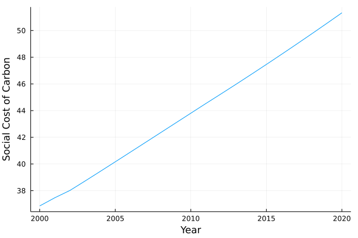

# Climate Unsustainability

Once climate valuation process has been applied, we propose to measure the climate unsustainability of a company. To do so, we will apply the concept of Benefit-Cost Analysis on the issue of climate change.

## Benefit-Cost Analysis Applied to Companies Climate Impacts

- Basic result of benefit-cost analysis (BCA) is that the policy or economic activity "worth it" if:
    - $B > C$

With $B$ the present value of benefits and $C$ the present value of costs associated with the policy or economic activity.

- BCA approach can be applied to a company business with:
    - R: revenue are the benefits associated with the business activities, as it represents the volume of goods or services sales to the society priced with a market price.
    - C: climate costs are the climate-related costs, valued with the methodology described previously

A measure of climate unsustainability can then be:

 $R_{CA} = R - C$

 With $R_{CA}$ being the climate-adjusted revenue, which is the net present value of benefits to the society from the company's activity.

- We can read it such as:

    - If $R_{CA} < 0$: the business activity causes more damages to the society than benefits, it is clearly unsustainable (here only the climate issue is assessed)
    - If $R_{CA} > 0$: the business activity still provides more benefits to the society than damages, it is still sustainable for a climate-focused analysis (adding damages from other ESG issues could lead to another result)


## Climate-adjusted Revenue Dynamic

- Two main sources can drive the climate-adjusted revenue dynamic:
    - the emissions intensity per revenue: emissions per dollar and then climate costs per dollar of revenue can increase or decrease, leading to an evolution of the climate-adjusted revenue
    - social cost of carbon can evolve in time due to the fact that closer we are to the main climate damages, higher are the present-value of expected damages


Let's try to see the dynamic of the SCC in the FUND Model (in 2020 USD):
```julia
# Social costs dynamic
using Mimi
using MimiFUND

m = MimiFUND.get_model()
update_param!(m, :climatedynamics, :climatesensitivity, 4.5)

list_scc_year = [i for i in 2000:2020]

scc_dynamic = []

for i in eachindex(list_scc_year)
    push!(scc_dynamic, MimiFUND.compute_scc(m, year = list_scc_year[i], eta = 1., prtp = 0.) * 1.68)
end


using Plots 

plot(list_scc_year, scc_dynamic, label = nothing, xlabel = "Year", ylabel = "Social Cost of Carbon")
``` 

