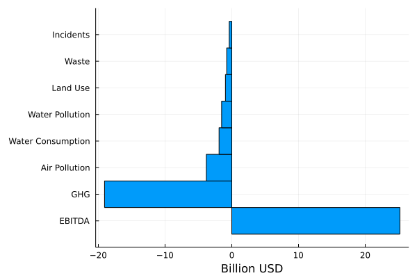

# Introduction 

The objective of this part is to explain how to conduct externalities valuation with Julia. 

## ESG Valuation: Correcting a Market Failure 

- ESG issues are extra-financial topics reflecting in externalities to society, coming from business activities. 

- These externalities are not priced-in and reflects a market failure (failure to price these externalities in a way that businesses activities can internalize it and change behavior accordingly)

- ESG valuation is a way to correct this market failure, associating costs to these externalities, allowing investors to adjust financial decisions based on the ESG-adjusted valuation

### Externalities as Market Failure

- Economic activity generates residuals / costs to society

- Some residuals are priced (at least partially) by markets:
    - some waste for example

- But vast majority of residuals are not priced by markets :
    - CO2 emissions, air pollution, most waste, water depletion, workers health and safety incidents, etc.

- If these residuals were priced, firms and consumers could internalize the associated costs

- If not priced, these costs to society are hidden or external (we call about externalities):
    - then allocation of resources within the economic / financial system may be inefficient
    - then measures of macroeconomic output and companies fundamentals may be inaccurate

### Correcting Market Failure

- Business activities must face cost of externalities

- To do so, one need to estimate ESG impacts (the costs to society)

- One approach used are the Integrated Assessment Models (IAMs) to estimate health effects and monetary damages

- However, ESG valuation can face some pitfalls:
    - Uncertainty (parameters values, data estimates)
    - Valuation and ethics (discount rate in the case of expected future damages of climate change for example)

## Conceptual Modeling

- ESG valuation allows for more accurate financial assessment, taking into account the hidden costs from business activties

- The approach pledges for an ESG integration into traditional accounting methods

### Sustainability as a Benefit-Cost to Society Analysis

- The rationale behing ESG valuation is such that:
    - activity is sustainable and worth doing if benefits (financial and extra-financial) are higher than costs (including costs to society)

## Empirical Methods

- ESG Valuation can be empirically conducted with:
    - a modeling approach linking impacts drivers (eg. GHG emissions) and outcomes to society (eg. impacts on human health, crop yields, etc.)
    - a valuation approach to translate various damages in monetary terms
    - determining a social cost (price) of the ESG issue by determining marginal damages associated with this ESG issue
    - applying this social cost to the company's externalities

### Integrated Assessment Models

- Integrated Assessment Models (IAMs) are a common tool to connect economic / anthropogenic activities with envrionmental consequences

- IAMs have been applied to various contexts:
    - Climate change
    - Air pollution
    - Water depletion

- IAMs embody a damage function approach: ESG issues assessed with this approach would be translated in damages to human health, materials, etc.

### Valuation 

- The valuation step aims for translating damages in monetary terms 

- It provides a common metric for:
    - ranking damages caused by differents ESG issues (climate change, air pollution, health & security for workers, etc)
    - aggregation across different damages types (deaths, illness, crop yields, material depreciation) and different ESG issues (leading to an overall ESG costs valuation)

### Social Cost

- Once damages and valuation is performed, we can compute the social cost per additional unit of residuals (eg. GHG emissions, air pollutant emitted) produced by the economic activity 

- When using IAMs, social cost is determined through the computation of a marginal model:
    - model the damages and associated cost with a baseline scenario
    - repeat the process after including a small amount of additional residuals to determine the impact on the total cost of related damages
    - the increase in damages from the additional emissions provides an estimated of the SCC.

## ESG Valuation vs. Traditional Financial Variables

The purpose of ESG valuation is to be able to assess the value to society produced by the company, alongside traditional financial measures such as EBITDA.

