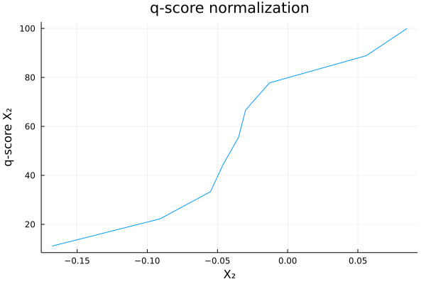
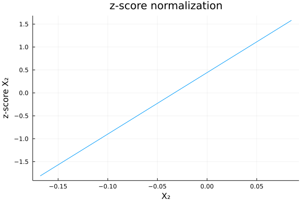

# ESG Scoring

- Most of ESG scoring systems are based on scoring trees. 
- Raw data are normalised in order to obtain features $X_1,...,X_m$
- Features $X_1,...,X_m$ are aggregated to obtain sub-scores $s_1,...,s_n$:
$s_i = \sum_{j=1}^m \omega_{i,j}^{(1)}X_j$
- Sub-scores $s_1,...,s_n$ are aggregated to obtain the final score $s$:
$s_i = \sum_{i=1}^n \omega_i^{(2)}s_i$
This two-level structure can be extended to multi-level tree structures.

Let's implement the first stage of our scoring system.

First, we create a struct `Variable`, with two examples variables:
```julia
Base.@kwdef mutable struct Variable
    X::Vector{Float64}
    name::String 
end

X₁ = Variable(X = [94.0, 38.6, 30.6, 74.4, 97.1, 57.1, 132.4, 92.5, 64.9], name = "X₁") 

X₂ = Variable(X = [-0.03, -0.0550, 0.056, -0.013, -0.168, -0.035, 0.0850, -0.0910, -0.0460], name = "X₂")
```

Let's also extend the functionality of `PrettyTables.jl` to support our new `Variable` struct:
```julia
using PrettyTables


function PrettyTables.pretty_table(X::Vector{Variable})
    x = reduce(hcat,[X[i].X for i in eachindex(X)])
    X_names = reduce(vcat,[X[i].name for i in eachindex(X)])
    return pretty_table(x, header = X_names)
end

pretty_table([X₁, X₂])
```

This prints a nice table in the `REPL`:
```
┌───────┬────────┐
│    X₁ │     X₂ │
├───────┼────────┤
│  30.6 │ -0.168 │
│  38.6 │ -0.091 │
│  57.1 │ -0.055 │
│  64.9 │ -0.046 │
│  74.4 │ -0.035 │
│  92.5 │  -0.03 │
│  94.0 │ -0.013 │
│  97.1 │  0.056 │
│ 132.4 │  0.085 │
└───────┴────────┘
```


Now, the question is: how can we aggregate $X_1$ and $X_2$ to create a synthetic score? 

We need to normalize the features $X_1, ..., X_n$!


## Normalizing Scores

Once raw data have been normalized in order to facilitate the comparison (ie. absolute carbon emissions amount transformed to carbon intensity for example), resulting features $X_1, ..., X_m$ need to be normalized to facilitate the aggregation process.


Several normalization approches exist:

- q-score normalization:
  - 0-1 normalization: $q_i \in [0,1]$
  - 0-10 normalization: $q_i \in [0,10]$
  - 0-100 normalization: $q_i \in [0,100]$
$q_i = \hat F(x_i)$
Where $\hat F$ is the empirical probability distribution.
- z-score normalization:

$z_i = \frac{x_i - \hat\mu(X)}{\hat\sigma(X)}$


To do so, let's implement a `Score` struct and a `ScoringSystem` struct. 

```julia
Base.@kwdef mutable struct Score
    S::Vector{Float64}} # resulting score
    name::String
end


using Graphs # import for the directed graph
using GraphPlot # import for the directed graph
import Cairo, Fontconfig # import for the directed graph

Base.@kwdef mutable struct ScoringSystem
    X::Vector{Variable}
    S::Union{Nothing, Vector{Score}} = nothing # the vector of subscores
    ω::Union{Nothing, Vector{Float64}} = nothing # the vector of weights
    graph::Union{Nothing,SimpleDiGraph} = nothing # directed graph representing the scoring tree 
    score::Union{Nothing,Score} = nothing # the vector of aggregated score
end

our_scoring = ScoringSystem(X = [X₁,X₂])
```

The purpose of the struct `Score` is to facilitate the interface between our `Variable`, our future functions for normalization, and the result (the `Score`). The purpose of the `ScoringSystem` struct is to regroup / organize our little scoring system.

### q-score

Let $x_1, .., x_n$ be the sample. We have:

$q_i = \hat{F}(x_i) = Pr(X \leq x_i) = \frac{\#(x_j \leq x_i)}{n_q}$

We can use two normalization factors:

- $n_q = n$
- $n_q = n + 1$

Let's implement this in Julia:
```julia
using Plots # to print the ecdf

function q_score(X::Variable; scale = 100, get_plot = true)::Score 
    # the number of observations
    n = length(X.X)
    # we normalize the number of observations less or equal to each observation by n + 1 (the second normalization factor)
    q = [length(filter(x -> x <= i, X.X))/(n+1) for i in X.X] .* scale
    s = Score(S = q, name = string("q-score ",X.name))
    # we print the ecdf of the variable to get a sense of q-score normalization
    if get_plot
        display(plot(sort(X.X), (1:n)./n * 100, 
            xlabel = X.name, ylabel = s.name,
            title = "q-score normalization", label = ""))
    end
    return s
end

# just the vector version of the function
function q_score(X::Vector{Variable}; scale = 100, get_plot = true)::Vector{Score}
    s = []
    for i in eachindex(X)
        push!(s, q_score(X[i]; scale, get_plot))
    end 
    return s 
end

# and finally the version applied to our scoring system
function q_score!(s::ScoringSystem; scale = 100, get_plot = true)::ScoringSystem
    s.S = q_score(s.X; scale, get_plot)
    return s
end

q_score!(our_scoring)
```

The resulting scoring functions looks like the graphs below:



Now let's again extend the `PrettyTables.jl` functionality to be applied on our `ScoringSystem`:
```julia

function PrettyTables.pretty_table(s::ScoringSystem)
    X = reduce(hcat,[s.X[i].X for i in eachindex(s.X)])
    S = reduce(hcat,[s.S[i].S for i in eachindex(s.S)])
    X_names = reduce(vcat,[s.X[i].name for i in eachindex(s.X)])
    S_names = reduce(vcat,[s.S[i].name for i in eachindex(s.S)])
    return pretty_table(hcat(X,S), header = vcat(X_names, S_names))
end

pretty_table(our_scoring)
```

We get the following table:
```
┌───────┬────────┬────────────┬────────────┐
│    X₁ │     X₂ │ q-score X₁ │ q-score X₂ │
├───────┼────────┼────────────┼────────────┤
│  94.0 │  -0.03 │       70.0 │       60.0 │
│  38.6 │ -0.055 │       20.0 │       30.0 │
│  30.6 │  0.056 │       10.0 │       80.0 │
│  74.4 │ -0.013 │       50.0 │       70.0 │
│  97.1 │ -0.168 │       80.0 │       10.0 │
│  57.1 │ -0.035 │       30.0 │       50.0 │
│ 132.4 │  0.085 │       90.0 │       90.0 │
│  92.5 │ -0.091 │       60.0 │       20.0 │
│  64.9 │ -0.046 │       40.0 │       40.0 │
└───────┴────────┴────────────┴────────────┘
```

### z-score

Another normalization method can be the $z$-score:
```julia
using Statistics # to load the mean and std functions

# z-score normalization for a unique variable
function z_score(X::Variable; get_plot = true)::Score 
    μ = mean(X.X)
    σ = std(X.X)
    z = [(i - μ) / σ for i in X.X]
    s = Score(S = z, name = string("z-score ",X.name))
    if get_plot
        display(plot(sort(X.X), sort(s.S), 
            xlabel = X.name, ylabel = s.name,
            title = "z-score normalization", label = ""))
    end
    return s
end

# vector version
function z_score(X::Vector{Variable}; get_plot = true)::Vector{Score}
    s = []
    for i in eachindex(X)
        push!(s, z_score(X[i]; get_plot))
    end 
    return s 
end

# version to be applied to our scoring system
function z_score!(s::ScoringSystem; get_plot = true)::ScoringSystem
    s.S = z_score(s.X; get_plot)
    return s
end

z_score!(our_scoring)
```




```
┌───────┬────────┬────────────┬────────────┐
│    X₁ │     X₂ │ z-score X₁ │ z-score X₂ │
├───────┼────────┼────────────┼────────────┤
│  94.0 │  -0.03 │   0.571788 │  0.0402241 │
│  38.6 │ -0.055 │   -1.16236 │  -0.294977 │
│  30.6 │  0.056 │   -1.41277 │    1.19331 │
│  74.4 │ -0.013 │ -0.0417363 │   0.268161 │
│  97.1 │ -0.168 │   0.668825 │   -1.81008 │
│  57.1 │ -0.035 │  -0.583265 │ -0.0268161 │
│ 132.4 │  0.085 │    1.77379 │    1.58215 │
│  92.5 │ -0.091 │   0.524834 │  -0.777666 │
│  64.9 │ -0.046 │  -0.339108 │  -0.174304 │
└───────┴────────┴────────────┴────────────┘
```

## Scoring Tree

As mentioned previously, most ESG scoring systems are based on scoring trees. Our example is a simple two-level tree structure.
Let's represent it with a directed graph:
```julia
function get_scoring_tree!(s::ScoringSystem)::ScoringSystem
    n = length(s.S) # number of subscores
    G = Graphs.SimpleDiGraph(n+1) # we add + 1 to n because we need to take into account the score (aggregated)
    for i in 2:n+1 
        add_edge!(G,i, 1)
    end 
    # plot the graph 
    nodelabel = vcat(["s"],[s.S[i].name for i in eachindex(s.S)])
    display(gplot(G, nodelabel = nodelabel))
    s.graph = G
    return s
end

get_scoring_tree!(our_scoring)
```


Finally, let's compute the aggregated score with $\omega_1 = 0.3$ and $\omega_2 = 0.7$:
```julia

function get_aggregate_score!(s::ScoringSystem)::ScoringSystem
# just the weighted sum
    s.score = Score(S = sum([s.S[i].S * s.ω[i] for i in eachindex(s.ω)]),
                    name = "Aggregate score")

    # will print the result in table format
    pretty_table(s.score.S, header = [s.score.name])
    return s
end

our_scoring.ω = [0.3, 0.7] # our weights vector

get_aggregate_score!(our_scoring)
```
```
┌─────────────────┐
│ Aggregate score │
├─────────────────┤
│        0.199693 │
│       -0.555191 │
│        0.411488 │
│        0.175192 │
│        -1.06641 │
│       -0.193751 │
│         1.63964 │
│       -0.386916 │
│       -0.223745 │
└─────────────────┘
```
