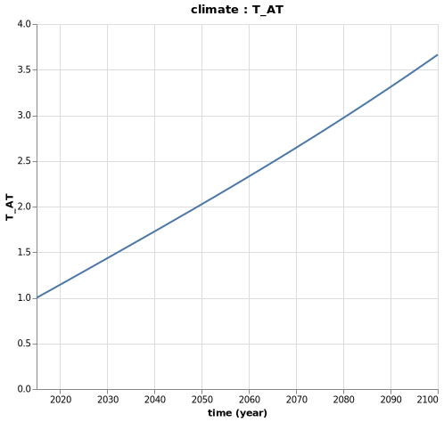

# Social Cost of Carbon

## What is the Social Cost of Carbon?

Social cost of carbon (SCC) is an estimate, in USD, of the economic damages that would result from emitting one additional ton of GHGs into the atmosphere. The SCC puts the effects of climate change into economic terms to help policy makers and other decision-makers understand the economic impacts of decisions that would increase or decrease emissions. 

## Integrated Assessment Models 

Integrated Assessment Models (IAMs) are economic models, coupled with climate component, used to determine future outcomes from climate change. Based on these models, the SCC is computed in four steps:

1. Predict future emissions based on population, economic growth and other factors
2. Model future climate responses, such as temperature increase and sea level changes 
3. Assess the economic impact of these climatic changes on agriculture, health, energy use and other aspects of the economy
4. Convert future damages into their present-day values and sum to determine total damages 

These four steps provide a baseline value for the damages caused by emissions. The modelling process is then repeated after including a small amount of additional emissions to determine the impact on the total cost of emissions-related damages. 
The increase in damages from the additional emissions provides an estimated of the SCC.

To illustrate the process and the `Mimi Framework` we will use, let's illustrate the process with a simple illustrative one region model.

## The Economy Component

We describe here a really simple toy world economy, with gross output and capital evolving according to fixed parameters and exogeneous variables.

### Endogeneous Variables

| Notation      | Description | Equation | 
| ----------- | ----------- |----------- |
| $Y_t$  |  Gross output   | $Y_t = TFP_t * K_t^\beta * L_t^{(1-\beta)}$    |
| $K_t$   | Capital        |  $K_t = (1 - \delta) * K_{t-1} + Y_{t-1} * s_{t-1}$|

### Parameters
| Notation      | Description |  
| ----------- | ----------- |
| $\delta$  |  Depreciation rate on capital  | 
| $\beta$   | Capital share |

### Exogeneous Variables
| Notation      | Description |  
| ----------- | ----------- |
| $L_t$  |  Labor  | 
| $TFP_t$   | Total factor productivity |
| $s_t$   | Savings rate |

### Julia Implementation

Let's first implement the economy component:
```julia 
# gross economy component
@defcomp grosseconomy begin 
    Y = Variable(index = [time]) # Gross output 
    K = Variable(index = [time]) # Capital 
    L = Parameter(index = [time]) # Labor
    TFP = Parameter(index = [time]) # Total factor productivity 
    s = Parameter(index = [time]) # Savings rate
    δ = Parameter() # Depreciation rate on capital 
    k0 = Parameter() # Initial level of capital 
    β = Parameter() # Capital share

    function run_timestep(p, v, d, t)
        # Define an equation for K 
        if is_first(t)
            # Note the use of v. and p. to distinguish between variables 
            # and parameters 
            v.K[t] = p.k0 
        else
            v.K[t] = (1 - p.δ) * v.K[t-1] + v.Y[t-1] * p.s[t-1]
        end

        # Define an equation for YGROSS 
        v.Y[t] = p.TFP[t] * v.K[t]^p.β * p.L[t]^(1-p.β)
    end
end
```


## The Emissions Component 

The emissions component is also really simplistic. The energy consumption is modelled as a function of the energy to output ratio and the gross output. Then the emissions are driven by the carbon intensity of the energy mix and the energy consumption. 

Note that the gross output is treated as an exogenous variable here.

### Endogeneous Variable

| Notation      | Description | Equation | 
| ----------- | ----------- |----------- |
| $M_t$  |  Energy necessary for the production of output | $M_t = \epsilon_t * Y_t$    |
| $E_t$  |  Total greenhouse gas emissions | $E_t = \omega_t * M_t$    |

### Exogeneous Variables
| Notation      | Description |  
| ----------- | ----------- |
| $\epsilon_t$  | Energy to output ratio (EJ/trillion USD)  |
| $\omega_t$  | $CO_2$ intensity (Gt/EJ)  | 
| $Y_t$   | Gross output |

### Julia Implementation
Let's implement it in Julia:
```julia

# component for greenhouse gas emissions 
@defcomp emissions begin 
    E = Variable(index = [time]) # Total greenhouse gas emissions 
    M = Variable(index = [time]) # Energy consumption

    ω = Parameter(index = [time]) # CO2 intensity of energy mix
    ϵ = Parameter(index = [time]) # energy intensity of output
    Y = Parameter(index = [time]) # Gross output - now a Parameter

    function run_timestep(p, v, d, t)
        # equation for M 
        v.M[t] = p.ϵ[t] * p.Y[t] # note the p. in front of gross 
        # Define an equation for E 
        v.E[t] = p.ω[t] * v.M[t]
    end
end
```

## The Climate Component

The formulation below of climate dynamics linked to emissions follows the traditional integrated assessment models. 
The emissions increase the atmospheric $CO_2$ concentration alongside the carbon cycle. The carbon cycle shows that every year there is exchange of carbon between the atmosphere and the upper ocean/biosphere and between the upper ocean/biosphere and the lower ocean. 

The accumulation of atmospheric $CO_2$ concentration increases radiative forcing, placing upward pressures on the atmospheric temperature.

Note that emissions are taken as exogenous in this component. 

### Endogeneous Variables

| Notation      | Description | Equation | 
| ----------- | ----------- |----------- |
| $CO2_{AT_t}$  | Atmospheric $CO_2$ concentration (Gt) | $CO2_{AT_t} = E_t + \phi_{1,1}CO2_{AT_{t-1}} + \phi_{2,1} CO2_{UP_{t-1}}$ |
| $CO2_{UP_t}$  |  Upper ocean/biosphere $CO_2$ concentration (Gt)  | $CO2_{UP_t} = \phi_{1,2}CO2_{AT_{t-1}}+\phi_{2,2}CO2_{UP_{t-1}} + \phi_{3,2}CO2_{LO_{t-1}}$ |
| $CO2_{LO_t}$  |   Lower ocean $CO_2$ concentration (Gt)   | $CO2_{LO_t} = \phi_{2,3}CO2_{UP_{t-1}} + \phi_{3,3}CO2_{LO_{t-1}}$ |
| $F_t$  |  Radiative forcing over pre-industrial levels (W/m2)  | $F_t = F_{2*CO2} log2\frac{CO2_{AT_t}}{CO2_{AT-PRE}} + F_{EX_t}$ |
| $F_{EX_t}$  |  Radiative forcing over pre-industrial levels, due to non $CO_2$ greenhouse gases (W/m2)  | $F_{EX_t} = F_{EX_{t-1}} + fex$ |
| $T_{AT_t}$  |  Atmospheric temperature over pre-industrial levels (°C)  | $T_{AT_t} = T_{AT_{t-1}} + t_1(F_t - \frac{F_{2*CO2}}{S}T_{AT_{t-1}} - t_2(T_{AT_{t-1}} - T_{LO_{t-1}}))$ |
| $T_{LO_t}$  |  Lower ocean temperature over pre-industrial levels (°C)  | $T_{LO_t} = T_{LO_{t-1}} + t_3(T_{AT_{t-1}} - T_{LO_{t-1}})$ |


### Parameters
| Notation      | Description |  
| ----------- | ----------- |
| $CO2_{AT-PRE}$  | Pre-industrial $CO_2$ concentration in atmosphere (Gt)  | 
| $CO2_{LO-PRE}$  | Pre-industrial $CO_2$ concentration in lower ocean (Gt)  | 
| $CO2_{UP-PRE}$  | Pre-industrial $CO_2$ concentration in upper ocean / biosphere (Gt)  | 
| $F_{2*CO2}$  | Increase in radiative forcing (since the pre-industrial period) due to doubling of $CO_2$ concentration from pre-industrial levels (W/m2) | 
| $fex$  | Annual increase in radiative forcing (since the pre-industrial period) due to non-$CO_2$ agents (W/m2)  | 
| $\phi_{1,1}$  | Transfer coefficient for carbon from the atmosphere to the atmosphere  | 
| $\phi_{1,2}$  | Transfer coefficient for carbon from the atmosphere to the upper ocean/biosphere  | 
| $\phi_{2,1}$  | Transfer coefficient for carbon from the upper ocean/biosphere to the atmosphere  | 
| $\phi_{2,2}$  | Transfer coefficient for carbon from the upper ocean/biosphere to the upper ocean/biosphere  | 
| $\phi_{2,3}$  | Transfer coefficient for carbon from the upper ocean/biosphere to the lower ocean  | 
| $\phi_{3,2}$  | Transfer coefficient for carbon from the lower ocean to the upper ocean/biosphere  | 
| $\phi_{3,3}$  | Transfer coefficient for carbon from the lower ocean to the lower ocean  | 
| $t_1$  | Speed of adjustment parameter in the atmospheric temperature equation | 
| $t_2$  | Coefficient of heat loss from the atmosphere to the lower ocean (atmospheric temperature equation) | 
| $t_3$  | Coefficient of heat loss from the atmosphere to the lower ocean (lower ocean temperature equation) | 
| $S$  | Equilibrium climate sensitivity | 

### Exogeneous Variables
| Notation      | Description |  
| ----------- | ----------- |
| $E_t$  |  Total greenhouse gas emissions  | 

### Julia Implementation 

We can implement it in Julia:
```julia
# component for climate 
@defcomp climate begin
    CO2_AT = Variable(index = [time]) # Atmospheric CO2 concentration 
    CO2_UP = Variable(index = [time]) # Upper ocean CO2 concentration 
    CO2_LO = Variable(index = [time]) # Lower ocean CO2 concentration 
    F = Variable(index = [time]) # Radiative forcing 
    FEX = Variable(index = [time]) # Radiative forcing due to non CO2 
    T_AT = Variable(index = [time]) # Atmospheric temperature over pre-industrial levels 
    T_LO = Variable(index = [time]) # Lower ocean tempature over pre-industrial levels 

    CO2_AT_0 = Parameter() # Initial value for CO2_AT
    CO2_UP_0 = Parameter() # Initial value for CO2_UP
    CO2_LO_0 = Parameter() # Initial value for CO2_LO
    F_0 = Parameter() # Initial value for F
    FEX_0 = Parameter() # Initial value for FEX
    T_AT_0 = Parameter() # Initial value for T_AT
    T_LO_0 = Parameter() # Initial value for T_LO

    CO2_AT_PRE = Parameter() # Pre-industrial CO2 concentration in atmosphere 
    CO2_LO_PRE = Parameter() # Pre-industrial CO2 concentration in lower ocean 
    CO2_UP_PRE = Parameter() # Pre-industrial CO2 concentration in upper ocean 
    F2CO2 = Parameter() # Increase in radiative forcing (since the pre-industrial period) due to doubling of CO2
    fex = Parameter() # Annual increase in radiative forcing (since the pre-industrial level)
    ϕ_11 = Parameter() # Transfer coefficient for carbon from the atmosphere to the atmosphere
    ϕ_12 = Parameter() # Transfer coefficient for carbon from the atmosphere to the upper ocean/biosphere
    ϕ_21 = Parameter() # Transfer coefficient for carbon from the upper ocean/biosphere to the atmosphere
    ϕ_22 = Parameter() # Transfer coefficient for carbon from the upper ocean/biosphere to the upper ocean/biosphere
    ϕ_23 = Parameter() # Transfer coefficient for carbon from the upper ocean/biosphere to the lower ocean
    ϕ_32 = Parameter() # Transfer coefficient for carbon from the lower ocean to the upper ocean/biosphere
    ϕ_33 = Parameter() # Transfer coefficient for carbon from the lower ocean to the lower ocean
    t_1 = Parameter() # Speed of adjustment parameter in the atmospheric temperature equation
    t_2 = Parameter() # Coefficient of heat loss from the atmosphere to the lower ocean (atmospheric temperature equation)
    t_3 = Parameter() # Coefficient of heat loss from the atmosphere to the lower ocean (lower ocean temperature equation)
    S = Parameter() # Equilibrium climate sensitivity 
    
    
    E = Parameter(index = [time]) # Total greenhouse gas emissions

    function run_timestep(p, v, d, t)
        if is_first(t)
            v.CO2_AT[t] = p.CO2_AT_0
            v.CO2_UP[t] = p.CO2_UP_0
            v.CO2_LO[t] = p.CO2_LO_0
            v.FEX[t] = p.FEX_0
            v.F[t] = p.F_0
            v.T_AT[t] = p.T_AT_0
            v.T_LO[t] = p.T_LO_0
        else
            # Equation for CO2_AT
            v.CO2_AT[t] = p.E[t] + p.ϕ_11 * v.CO2_AT[t-1] + p.ϕ_21 * v.CO2_UP[t-1]
            # Equation for CO2_UP 
            v.CO2_UP[t] = p.ϕ_12 * v.CO2_AT[t-1] + p.ϕ_22 * v.CO2_UP[t-1] + p.ϕ_32 * v.CO2_LO[t-1]
            # Equation for CO2_LO 
            v.CO2_LO[t] = p.ϕ_23 * v.CO2_UP[t-1] + p.ϕ_22 * v.CO2_LO[t-1]
            # radiative forcing other 
            v.FEX[t] = v.FEX[t-1] + p.fex 
            # Radiative forcing 
            v.F[t] = p.F2CO2 * log2(v.CO2_AT[t]/p.CO2_AT_PRE) + v.FEX[t]
            # Atmospheric temperature 
            v.T_AT[t] = v.T_AT[t-1] + p.t_1 * (v.F[t] - p.F2CO2 / p.S * v.T_AT[t-1] - p.t_2 * (v.T_AT[t-1] - v.T_LO[t-1]))
            # Lower ocean temperature
            v.T_LO[t] = v.T_LO[t-1] + p.t_3 * (v.T_AT[t-1] - v.T_LO[t-1])
        end
    end
end

```

## The Damages Component

The Damages Component use the Damage function formulated by Weitzman (2012), with a calibration such as the damages in percentage of gross output is equal to 50% when the increase in atmospheric temperature is at 6°C.

### Endogeneous Variables

| Notation      | Description | Equation | 
| ----------- | ----------- |----------- |
| $D_t$  | Damages (in % of Gross output) | $D_t = 1 - \frac{1}{1 + \eta_1 T_{AT_t} + \eta_2 * T_{AT_t}^2 + \eta_3 * T_{AT_t}^{6.754}}$ |
| $\Omega_t$  | Damages in USD | $\Omega_t = D_tY_t$ |


### Parameters
| Notation      | Description |  
| ----------- | ----------- |
| $\eta_1$  | Parameter of damage function | 
| $\eta_2$  | Parameter of damage function | 
| $\eta_3$  | Parameter of damage function | 


### Exogeneous Variables
| Notation      | Description |  
| ----------- | ----------- |
|  $T_{AT_t}$  |  Atmospheric temperature over pre-industrial levels (°C)|
|  $Y_t$  |  Gross output |

#### Julia Implementation 

Let's implement it in Julia:
```julia

# component for damages 
@defcomp damages begin
    D = Variable(index = [time]) # Damages (in % of gross output)
    Ω = Variable(index  = [time]) # Damages in USD

    η₁ = Parameter() # Parameter of damage function 
    η₂ = Parameter() # Parameter of damage function 
    η₃ = Parameter() # Parameter of damage function 

    T_AT = Parameter(index = [time]) # Atmospheric temperature increase 
    Y = Parameter(index = [time]) # Gross output 

    function run_timestep(p, v, d, t)

        v.D[t] = 1 - 1 / (1 + p.η₁ * p.T_AT[t] + p.η₂ * p.T_AT[t]^2 + p.η₃ * p.T_AT[t]^6.754)
        v.Ω[t] = v.D[t] * p.Y[t]
        
    end

end
```


## Binding All Components Together

We can now use `Mimi`to bind the `grosseconomy`, the `emissions`, the `climate` and the `damages` components together, in order to solve for the emissions level of the global economy over time and the resulting damages.

```julia
# STEP 2: CONSTRUCT A MODEL BY BINDING BOTH COMPONENTS 

# if anay variables of one component are parameters for another, connect_param! is
# used to couple the two

function construct_model(;marginal = false)
    m = Model()

    set_dimension!(m, :time, collect(2015:1:2100))

    # Order matters here, if the emissions component defined first, error
    add_comp!(m, grosseconomy)
    add_comp!(m, emissions)
    add_comp!(m, climate)
    add_comp!(m, damages)

    """
    update_param! used to assign values each component parameter 
    with an external connection to an unshared model param 
    """
    # Update parameters for the grosseconomy component
    update_param!(m, :grosseconomy, :L, [(1. + 0.003)^t * 6.404 for t in 1:86])
    update_param!(m, :grosseconomy, :TFP, [(1 + 0.01)^t * 3.57 for t in 1:86])
    update_param!(m, :grosseconomy, :s, ones(86) .* 0.22)
    update_param!(m, :grosseconomy, :δ, 0.1)
    update_param!(m, :grosseconomy, :k0, 130.)
    update_param!(m, :grosseconomy, :β, 0.3)

    # update parameters for the emissions component 
    update_param!(m, :emissions, :ω, [(1. - 0.002)^t * 0.07 for t in 1:86])
    
    if marginal # we'll see later the use of this
        pulse = 1/1e10 # units of emissions are Gt then we convert 1 ton of pulse in Gt 
        update_param!(m, :emissions, :ϵ, [(1. - 0.002)^t * (7.92 + pulse) for t in 1:86])
    else
        update_param!(m, :emissions, :ϵ, [(1. - 0.002)^t * 7.92 for t in 1:86])
    end

    # update parameters for the climate component 
    update_param!(m, :climate, :CO2_AT_0, 3120)
    update_param!(m, :climate, :CO2_UP_0, 5628.8)
    update_param!(m, :climate, :CO2_LO_0, 36706.7)
    update_param!(m, :climate, :F_0, 2.30)
    update_param!(m, :climate, :FEX_0, 0.28)
    update_param!(m, :climate, :T_AT_0, 1.0)
    update_param!(m, :climate, :T_LO_0, 0.0068)

    update_param!(m, :climate, :CO2_AT_PRE, 2156.2)
    update_param!(m, :climate, :CO2_LO_PRE, 36670.0)
    update_param!(m, :climate, :CO2_UP_PRE, 4950.5)
    update_param!(m, :climate, :F2CO2, 3.8)
    update_param!(m, :climate, :fex, 0.005)
    update_param!(m, :climate, :ϕ_11, 0.9817)
    update_param!(m, :climate, :ϕ_12, 0.0183)
    update_param!(m, :climate, :ϕ_21, 0.0080)
    update_param!(m, :climate, :ϕ_22, 0.9915)
    update_param!(m, :climate, :ϕ_23, 0.0005)
    update_param!(m, :climate, :ϕ_32, 0.0001)
    update_param!(m, :climate, :ϕ_33, 0.9999)
    update_param!(m, :climate, :t_1, 0.027)
    update_param!(m, :climate, :t_2, 0.018)
    update_param!(m, :climate, :t_3, 0.005)
    update_param!(m, :climate, :S, 3)

    # update parameters for damages function 

    update_param!(m, :damages, :η₁, 0)
    update_param!(m, :damages, :η₂, 0.00284)
    update_param!(m, :damages, :η₃, 0.000005)

    # connect parameters for the emissions component 
    connect_param!(m, :emissions, :Y, :grosseconomy, :Y)

    # connect parameters for the climate component 
    connect_param!(m, :climate, :E, :emissions, :E)

    # connect parameters for the damages component
    connect_param!(m, :damages, :T_AT, :climate, :T_AT)
    connect_param!(m, :damages, :Y, :grosseconomy, :Y)

    return m
end
```

#### Running the Model and Exploring Results

Now, we can run the model and examine the results:
```julia 
m = construct_model()
run(m)

# Check model resutls 
getdataframe(m, :emissions, :E)
```

And we can vizualize the results via plotting and explorer:
```julia
# Plot model results
Mimi.plot(m, :grosseconomy, :Y)
Mimi.plot(m, :emissions, :E)
Mimi.plot(m, :climate, :T_AT)
Mimi.plot(m, :damages, :D)
```
So, what does our simplistic model tell us?

First, the output should continue to grow according to our hypothesis, up to hundreds of trillion USD! 


Second, due to our assumptions on the carbon intensity and energy intensity evolutions, alongside the economic growth, the emissions should grow such as:


Due to these emissions, the atmospheric temperature should increase by 3.5°C by the end of the century.



Which could result to up to 6.5% of yearly GDP damages by 2100:


You can also explore interactively all the variables in your model with the following command:
```julia
# Observe all model result graphs in UI
explore(m)
```

## Computing Present-Day Values of Damages

So, now that we have our estimated model, we need to convert future damages into their present-day values and sum to determine total damages:
```julia
# STEP 5 PRESENT VALUE OF DAMAGES IN BASELINE SCENARIO
discount_rate = 0.035 # value recommended by the VBA
discount_factors = [(1/(1 + discount_rate))^((t-1)) for t in 1:86] 
damages_usd = getdataframe(m, :damages, :Ω)
present_value_damages = sum(discount_factors .* damages_usd[:,:Ω])
```
Which outputs:
```
35.86557996740484
```
That means a 35.8 trillion USD present-value of expected damages in our baseline scenario!

## Marginal Model and SCC

Now, we just need to repeat the process by including an increase of 1 ton of $CO_2$ emitted (what we call the marginal model), compute the present-value of damages and the differential with the baseline model. This differential is the SCC!

```julia 
# STEP 6 RUN THE MARGINAL MODEL AND COMPUTE THE SCC

m2 = construct_model(marginal = true) # now we see the use of the marginal keyword!
run(m2)

damages_usd_m2 = getdataframe(m2, :damages, :Ω)
present_value_damages_m2 = sum(discount_factors .* damages_usd_m2[:,:Ω])

scc = (present_value_damages_m2 - present_value_damages) * 10^12 # to express in USD per ton rather than trillion USD
``` 
Which gives the following SCC:
```
445.346870492358
```

## Models from the Interagency Working Group

In its establishment of estimates of the social cost of carbon for use across the federal United States government, the Interagency Working Group on the Social Cost of Greenhouse Gases (IWG) utilized three integrated assessment models from the peer-reviewed literature. To improve the transparency and accessibility of the IWG models, Resources for the Future (RFF) has release the `MimiIWG`, using the same `Mimi` package we used for our toy model.

This package allows users to easily access, run and modify all the model versions and specific configurations utilized by the IWG. 

A video tutorial by David Anthoff (UC Berkeley), the creator of the `Mimi` package, is available here:

[](https://youtu.be/C2rqpHk3Rek)
