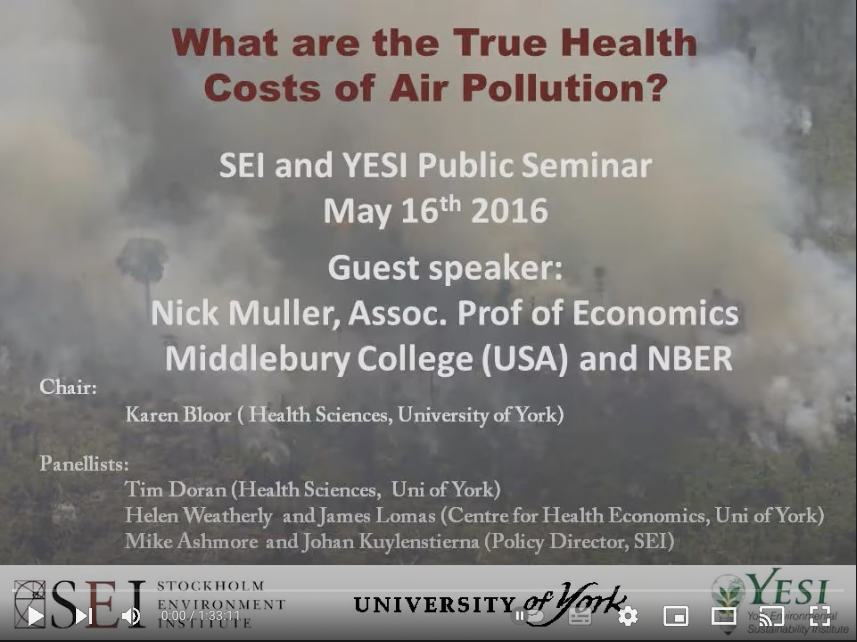

# Social Cost of Air Pollution

We propose here an illustrative and simplified one country model to value externalities linked with air pollution (fine particulate matter in this case).

Air pollution is really spatial and meteorological dependent. Specific Integrated Assessment Models for air quality have been developed, with granular geospatial assessment alongside dispersion model, in order to determine increase in concentration due to increase in pollutant emissions. 

However, this approach is location-specific and computationaly intensive. 

We propose here a roughly simplified approach, taken as given the exposure parameters and focusing on the health impact and valuation assessment.

The model is calibrated to roughly match the World Bank (2016) estimates.

## The Exposure Component

Contrary to a full IAM model dedicated to air quality assessment, we switch here the dispersion modelling according to the emissions and the exposure computation based on population density grids and meteorological conditions. 

We use the data regarding average exposure as given from the World Bank.

### Endogeneous Variables

| Notation      | Description | Equation | 
| ----------- | ----------- |----------- |
| $Pop_{PM_{2.5}}$  | Population exposed to certain threshold of $PM_{2.5}$ |  $Pop_{PM_{2.5}} = \%Pop_{PM_{2.5}} * Pop_{Tot}$ |
| $Exceed_{PM_{2.5}}$  | Excess exposure to $PM_{2.5}$ in micro gram / m3 |  $Exceed_{PM_{2.5}} = \mu_{PM_{2.5}} - \theta_{PM_{2.5}}$ |


### Parameters
| Notation      | Description |  
| ----------- | ----------- |
| $\theta_{PM_{2.5}}$  | Threshold to $PM_{2.5}$ exposure in micro gram / m3| 
| $\mu_{PM_{2.5}}$  | Average $PM_{2.5}$ exposure in micro gram / m3 | 

### Julia Implementation 
```julia 
using Mimi

@defcomp exposure begin 
    
    POP_25 = Variable(index = [time]) # Population exposed to certain threshold of PM2.5 concentration 
    Exceed_PM25 = Variable(index = [time]) # Excess micro gram exposure to PM2.5

    Percent_POP_PM25 = Parameter() # Percentage of population exposed to certain threshold 
    Pop_Tot = Parameter() # Total population 
    θ_PM25 = Parameter() # Threshold to PM_25 exposure 
    μ_PM25 = Parameter() # Average PM_25 exposure

    function run_timestep(p, v, d, t)
        v.POP_25[t] = p.Percent_POP_PM25 * p.Pop_Tot
        v.Exceed_PM25[t] = p.μ_PM25 - p.θ_PM25
    end

end
```

## The Human Health Component

Translating population exposure to human health impact involves the use of dose-response functions. This dose-response functions links, in that case, the exposure to fine particulate matter higher than a certain threshold and premature mortality cases.

Finally, to transform the premature mortality cases in monetary value, we use the Value of Statistical Life (VSL) concept, based on the Willingness to Pay (WTP) approach, which aims to estimate the willingness of individuals to pay for marginal reductions in their mortality. Such estimates are not available for every countries, and one need to determine a value transfer of this VSL, generally only available for some high income countries.

### Endogeneous Variables

| Notation      | Description | Equation | 
| ----------- | ----------- |----------- |
| $Mort$  | Premature mortality |  $Mort = \alpha _0 * Exceed_{PM_{2.5}} * Pop_{PM_{2.5}}$ |
| $\Omega_{Mort}$  | Health cost of premature mortality |  $\Omega_{Mort} = VSL * Mort$ |
| $VSL$  | Value of statistical life |  $VSL = VSL_{OECD} (\frac{y}{y_{OECD}})^e$ |


### Parameters
| Notation      | Description |  
| ----------- | ----------- |
| $Pop_{PM_{2.5}}$  | Population exposed to certain threshold of $PM_{2.5}$ | 
| $\alpha _0$  | Dose response function of premature mortality | 
| $y$  | GDP per capita in the country of the activity considered | 
| $y_{OECD}$  | Average GDP per capita in OECD countries | 
| $e$  | Income elasticity of the VSL | 

### Julia Implementation 

Let's implement this in Julia 

```julia 
@defcomp human_health begin
    
    Mort = Variable(index = [time]) # Premature Mortality
    Ω_Mort = Variable(index = [time]) # Health costs of premature Mortality
    VSL = Variable(index = [time]) # Value of statistical life

    POP_25 = Parameter(index = [time]) # Population exposed to certain threshold of PM 2.5
    Exceed_PM25 = Parameter(index = [time]) # Excess exposure in micro gram / m3

    alpha_0 = Parameter() # Dose response function of premature mortality 
    y = Parameter() # GDP per capita in the country of the activity 
    y_OECD = Parameter() # Average GDP per capita in the OECD countries 
    e = Parameter() # Income elasticity of VSL
    VSL_OECD = Parameter() # Value of statistic life of reference

    function run_timestep(p, v, d, t)
        v.Mort[t] = p.alpha_0 * p.Exceed_PM25[t] * p.POP_25[t]
        v.VSL[t] = p.VSL_OECD * (p.y / p.y_OECD)^(p.e)
        v.Ω_Mort[t] = v.VSL[t] * v.Mort[t]
    end
end
```

## Binding All Components Together

Finally, we can combine the `exposure` and `human_health` together. We use data for China.

```julia 

function construct_model()

    m = Model()
    set_dimension!(m, :time, collect(1:1)) # we only have data for one year here and no projection

    add_comp!(m, exposure)
    add_comp!(m, human_health)

    update_param!(m, :exposure, :Percent_POP_PM25, 1.) # China
    update_param!(m, :exposure, :Pop_Tot, 1.4*10^9) # China
    update_param!(m, :exposure, :θ_PM25, 35)
    update_param!(m, :exposure, :μ_PM25, 53) # China

    update_param!(m, :human_health, :alpha_0, 0.000134) 
    update_param!(m, :human_health, :y, 10500.) 
    update_param!(m, :human_health, :y_OECD, 37000.) 
    update_param!(m, :human_health, :e, 0.8) 
    update_param!(m, :human_health, :VSL_OECD, 1. * 10^6) 

    connect_param!(m, :human_health, :POP_25, :exposure, :POP_25)
    connect_param!(m, :human_health, :Exceed_PM25, :exposure, :Exceed_PM25)

    return m
end
```

## Computing Cost of Air Pollution

Let's run the model first:
```julia
m = construct_model()
run(m)
```

Let's see by how much the average exposure to particulate matter is higher than the limit threshold:
```julia
getdataframe(m, :human_health, :Exceed_PM25)
```

Which gives a value of 18 micro gram per m3:
```
│ Row │ time  │ Exceed_PM25 │
│     │ Int64 │ Float64?    │
├─────┼───────┼─────────────┤
│ 1   │ 1     │ 18.0        │
```

According to the World Bank, all the Chinese population was exposed to such particulate matter concentration in 2017. This leads to the following estimate of number of premature deaths:
```julia
getdataframe(m, :human_health, :Mort)
```

```
1×2 DataFrame
│ Row │ time  │ Mort     │
│     │ Int64 │ Float64? │
├─────┼───────┼──────────┤
│ 1   │ 1     │ 3.3768e6 │
```

We also find the following value for VSL in China:
```julia
getdataframe(m, :human_health, :VSL)
```
```
│ Row │ time  │ VSL       │
│     │ Int64 │ Float64?  │
├─────┼───────┼───────────┤
│ 1   │ 1     │ 3.65082e5 │
```

Which gives the following estimates in USD:
```julia
value_baseline = getdataframe(m, :human_health, :Ω_Mort)
```
```
│ Row │ time  │ Ω_Mort     │
│     │ Int64 │ Float64?   │
├─────┼───────┼────────────┤
│ 1   │ 1     │ 1.23281e12 │
```

Let's express it in percentage of China's GDP to get a better sense of this value:
```julia
getdataframe(m, :human_health, :Ω_Mort)[1, :Ω_Mort]/ (14722730.70 * 10^6)
```
```
0.08373500119660764
```
According to this estimate, the air pollution costs around 8.4% of GDP equivalent in terms of negative externatilities. This is quite close to the World Bank estimates (2016).

Last but not least, we can use this estimate to derive a social cost per ton of fine particulate matter in China. 
To do so, we use as a proxy the ratio health costs in USD and the amount of emitted fine particulate matter in China, expressed in ton:
```julia
china_PM25 = 9926.4 * 10^(3)

social_cost = getdataframe(m, :human_health, :Ω_Mort)[1, :Ω_Mort] / china_PM25 
```
Which gives:
```
124194.8614585179
```
According to this simplistic model, the social cost of fine particulate matter in China is then at 124,195 per ton. 
This high price is noteworthy due to the already high (and above health limits) concentration in the country. 

## The APEEP Platform

While the approach presented above is quite simplistic, one can learn more about more realistic air pollution damages assessment with the use of the Air Pollution Emission Experiments and Policy Analysis (APEEP) model. It is an integrated assessment model that links emissions of air poluution to exposures, physical effects and monetary damages in the contiguous United States. 

[](https://youtu.be/lrp2Yz5RhN8)
