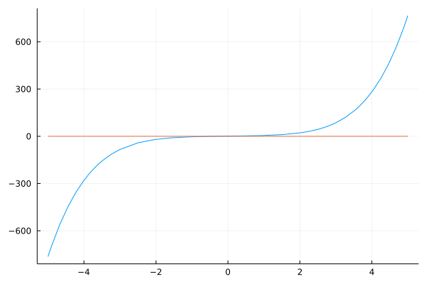

# Solutions of Nonlinear Equations

A solution to an equation $f(x) = 0$ is called a root, that is $x^*$ is a root of $f(x)=0$ if 

$f(x^*) = 0$

One can find a root of a function $ f : \mathbb{R} \rightarrow \mathbb{R}$ only if the function is continuous, i.e. if you can drow the graph of $y = f(x)$ on a sheet of paper without lifting your pencil. 


## Bisection Algorithm

We begin with the most intuitive method for finding roots of scalar equations 

$f(x) = 0$

Where $ f : \mathbb{R} \rightarrow \mathbb{R}$ (i.e. $f$ maps real numbers to real numbers. )

### Intermediate Value Theorem 

Assuming that $f$ is a continuous real valued function and we know two real numbers $a<b$ such that $f(a)*f(b) < 0$. Then ehre exists a real number $c$ such that:

1. $a < c < b$ ($c$ is between $a$ and $b$)

2. $f(c) = 0$ ($c$ is a root)

The values $a$ and $b$ are said to bracket the root $c$.

### Implementation 

Let's take an example with the function

$f(x) = 0.2x^5 + x^3 + 3x + 1$

Let's implement and plot this function in Julia to get a sens of it:
```julia
using Plots

f(x) = 0.2*x^5+x^3+3*x+1 # our function 
f_2(x) = 0 # utility function to plot the zero line
plot(f, label = "")
plot!(f_2, label = "")
```



Bisection method is a root-finding method that applies to any continuous functions for which one knows two values with opposite signs.

The method consists of repeatedly bisecting the interval defined by these values and then selecting the subinterval in which the function changes sign, and therefore must contain a root. 

### Iteration tasks 

The input for the method is a continuous function $f$, an interval $[a,b]$, and the function values $f(a)$ and $f(b)$.

The function values are of opposite sign (there is at least one zero crossing whitin the interval). 

Each iteration perfoms these steps:

1. Calculate $c$, the midpoint of the interval, $c = \frac{a+b}{2}$.
2. Calculate the function value at the midpoint, $f(c)$.
3. If converge is satisfactory (that is, $c-a$ is sufficiently small, or $|f(c)|$ is sufficiently small), return $c$ and stop iterating.
4. Examine the sign of $f(c)$ and replace either $(a, f(a))$ or $(b,f(b))$ with $(c, f(c))$ so that there is a zero crossing within the new interval.

### Example

Let's start with an easy problem: Consider $f(x) = (x-1)^2 - 4. 

We know $f(3) = 0$ ; hence $x = 3$ is a root of $f(x)$. 

Let's implement it in Julia:
```julia
function f(x)
    return (x-1)^2 - 4 
end


a = 0; b = 5; # The interval 
delta = 1e-9; # the convergence threshold

# Set a max iteration so we don't get stuck in the loop forever 
MAX_ITER = 100;
N = 1; # counter for iteration 

while N < MAX_ITER
    # Step 1: calculate c, the midpoint of the interval 
    c = (a + b) / 2;
    # Step 2: calculate the function value at the midpoint c
    fc = f(c);
    # Step 3: if converge is satisfactory (c-a sufficiently small or absolute function value sufficiently small), return C and stop
    if abs(c-a) < delta || abs(fc) < delta 
        println("Converged at iteration: N = ", N)
        break 
    end
    N += 1
    # Step 4: examine the sign of f(c) and replace either (a, f(a)) or (b, f(b)) with (c, f(c)) so that there is a zero crossing the new interval
    if sign(fc) == sign(f(a)) # update the search interval 
        a = c;
    else
        b = c;
    end
end

c = (a + b) / 2
print("c:", c, "\n")
print("f(c):", f(c), "\n")
```

The output will be:
```
Converged at iteration: N = 33
c:2.9999999998835847
f(c):-4.656612873077393e-10
```
## Newton's method 

Newton's method is a root-finding algorithm which produces successively better approximations to the roots (or zeros) of a real-valued function.

The idea is to start with an initial guess which is reasonably close to the true root, then to approximate the function by its tangent line using calculus, and finally to compute the x-intercept of this tangent line by algebra.

The equation of the tangent line to the curve $y = f(x)$ at $x = x_n$ is:

$y = f'(x_n)(x-x_n)+f(x_n)$

Where $f'$ denotes the derivative.

The derivative of $f$ shows its rate of change with respect to $x$. Assuming no knowledge of calculs, we use an approximation method called finite difference method to replace the derivative term.

### Finite difference method

Finite differences approximate the derivatives of functions via discretizations.
Three types are commonly considerd: forward, backward and central finite differences.
Here we will introduce central finite differences only, because it gives the best approximation of the derivative.

Consider $f(x)$ and its derivative at $x = a$, i.e., $f'(a)$. A central finite difference approximation of the derivative is given by:

$f'(a) = \frac{f(a+h) - f(a-h)}{2h}$

The finite difference method relies on discretizing a function on a grid.

## Back to Newton's method 

We now replace the derivative in $y = f'(x_n)(x - x_n) + f(x_n)$ with its finite difference approximation.

To find a root of $f(x)$, we set $y=0$.

$y = \frac{f(x_n+h) - f(x_n - h)}{2h}(x-x_n)+f(x_n)=0$

and 

$x = x_n - 2h \frac{f(x_n)}{f(x_n+h)-f(x_n-h)}$

To use this last formula iteratively, we use the following succession rule:

$x_n+1 = x_n - 2h \frac{f(x_n)}{f(x_n+h)-f(x_n-h)}$

Starting with an initial guess, $x_0$, that is near the solution, we can iterate to find the root.
It is important to choose a sufficiently smalll $h$ to reduce the discretization error.

### Example 

Let's consider the same example than with the bisection algorithm: we consider $f(x) = (x-1)^2 - 4$.

We know $f(3) = 0$ ; hence $x = 3$ is a root of $f(x)$. We pick $x_0 = 2$ as the initial guess.

In Julia:
```julia
function f(x)
    return (x-1)^2 - 4
end

x₀ = 2; h = 0.01/2; # initial guess x₀ and step size h 
delta = 1e-9; # set a convergence threshold

# set a max iteration so we don't get stuck in the loop 
MAX_ITER = 100;
N = 1; # counter for iteration 
while N < MAX_ITER
    # evaluate f at current guess 
    f₀ = f(x₀ - h); # f(xₙ - h)
    f₁ = f(x₀); # f(xₙ)
    f₂ = f(x₀ + h); # f(xₙ + h)
    df = f₂ - f₀ # approximate the derivative with finite difference
    if abs(df) < delta 
        println("Newton's method did not converge; derivative is near zero.")
        break 
    else
        dx = -2*h * (f₁ / (f₂ - f₀)); # finite difference approximation
    end
    if abs(dx) < delta
        println("Converged at iteration: N = ", N)
        break 
    else
        x₀ = x₀ + dx; # find next xₙ
    end
    N += 1;
end

print("root: ", x₀, "\n")
print("f(root): ", f(x₀), "\n") 
```
Which gives:
```
Converged at iteration: N = 6
root: 3.000000000000002
f(root): 8.881784197001252e-15
```

## Derivatives & Jacobian 

- The input is a vector such as $x \in \mathbb{R}^m$. If we use the standard basis of $\mathbb{R}^m$, we have:

$x = x_1 e_1 + x_2 e_2 + \cdots + x_n e_m = \sum^m_{i=1}x_ie_i$

- Then we can use a finite difference approximation to compute each column of $A = [a^{col}_1 \cdots a^{col}_m]$ as 

$a^{col}_i = \frac{\partial f(x_0)}{ \partial x_i} = \frac{f(x_0 + he_i) - f(x_0 - he_i)}{2h}$

- For the general case of $f : \mathbb{R}^m \rightarrow \mathbb{R}^n$, $A$ is an $n*m$ matrix and called the Jacobian of $f$, i.e.,

$A_{n*m} = [a^{col}_1 \cdots  a^{col}_m] = \frac{\partial f(x)}{\partial x}$

- Each column of the Jacobian $a^{col}_i = \frac{\partial f(x)}{ \partial x_i} \in \mathbb{R}^n$ shows the rate of change of $f$ along $e_i$.

Let's implement the function in Julia:
```julia
using LinearAlgebra

function Jacobian(func, x₀, h = 0.001)
    # Numerical Jacobian of f:R^m -> R^n 
    m = length(x₀); # Domain dimension 
    f₀ = func(x₀);
    n = length(f₀); # Range dimension

    if m == 1 # f:R -> R^n 
        return (func(x₀ .+ h) .- func(x₀ .- h)) ./ (2 * h)
    else
        Im = Matrix(1.0I, m, m); # Create standard basis for I_m 
        A = zeros(n, m); # Create Jacobian matrix 
        # Compute and fill in the columns of the Jacobian using central difference 
        for i  = 1:m 
            ei = Im[:, i:i]
            A[:,i] = (func(x₀ + h * ei) - func(x₀ - h * ei)) / (2*h);
        end
        return A
    end
end 
```

### Example 

For the function

$$f(x_1, x_2, x_3) := \left[
\begin{array}{c}
x_1 x_2 x_3 \\
\log(2+\cos(x_1)) + x_2^{x_1}  \\
 \frac{x_1 x_3}{1+ x_2^2}
\end{array}
\right]$$

we want to compute its Jacobian at the point:

$$x_0 = \left[
\begin{array}{c}
\pi \\
1.0  \\
2.0
\end{array}
\right]$$

Let's test our function with Julia:
```julia

function f3(x)
    return [x[1]*x[2]*x[3]; log(2+cos(x[1])) + x[2]^x[1]; (x[1]*x[3] / (1+x[2]^2))]
end

x₀ = [π; 1.0; 2.0] # initial guess 
A = Jacobian(f3, x₀)
```

Which gives us the Jacobian:
```
3×3 Matrix{Float64}:
 2.0   6.28319  3.14159
 0.0   3.14159  0.0
 1.0  -3.14159  1.5708
```
## Newton-Raphson for Vector Functions

- Let $x_k$ be our current approximation of a root of the function $f$.

- We write the linear approximation of $f$ about $x_k$ as:

$f(x) \approx f(x_k) + A(x-x_k)$

Where $A = \frac{\partial f(x_k)}{\partial x}$

### Iteration tasks 

We can formulate the Newton-Raphson algorithm such as:

1. Start with an initial guess $x_0$ $(k=0)$
2. Solve the linear system $A\delta x_k = -f(x_k)$
3. Update the estimated root $x_{k+1} = x_k + \delta x_k$
4. Repeat (go back to step 2) until convergence