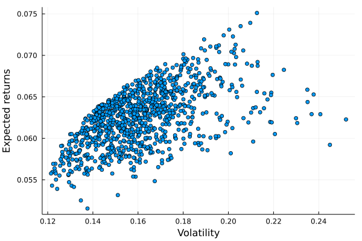

# The Markowitz framework

## Portfolio definition 

- We consider a universe of $n$ assets

- The vector of weights in the portfolio: 

$x = (x_1,...,x_n)$ 

- The portfolio is fuly invested:

$\sum^n_{i=1} x_i = 1_n^Tx = 1$

- The vector of asset returns where $R_i$ is the return of asset $i$

$R = (R_1,...,R_n)$

- The return of the portfolio is equal to:

$R(x) = \sum^n_{i=1}x_iR_i = x^TR$

- The vector of expected returns

$\mu = E[R]$ 

- The covariance matrix of asset returns:

$\Sigma = E[(R-\mu)(R-\mu)^T]$

Let's implement a `Portfolio` struct to encode these first informations: 
```julia
Base.@kwdef mutable struct Portfolio 
    μ::Vector{Float64} # the expected returns 
    σ::Vector{Float64} # volatiltiy
    x::Vector{Float64} # Weights
    C::Matrix # Correlation matrix
    Σ::Union{Nothing, Matrix} = nothing # Covariance matrix
end
```

And create a first example:
```julia
example_1 = Portfolio(μ = [0.05, 0.06, 0.08, 0.06],
                        σ = [0.15, 0.20, 0.25, 0.30],
                        x = [1/4 for i in 1:4], # just equally-weighted portfolio,
                        C = [
                            1 0.1 0.4 0.5
                            0.1 1 0.7 0.4
                            0.4 0.7 1 0.8
                            0.5 0.4 0.8 1
                            ])
```

We extend the function `pretty_table` to be used with our `Portfolio` struct:
```julia
using PrettyTables

function PrettyTables.pretty_table(portf::Portfolio)
    return pretty_table(reduce(hcat,[portf.μ, portf.σ, portf.x]), header = ["μ","σ","x"])
end


pretty_table(example_1)
```
We get:
```
┌──────┬──────┬──────┐
│    μ │    σ │    x │
├──────┼──────┼──────┤
│ 0.05 │ 0.15 │ 0.25 │
│ 0.06 │  0.2 │ 0.25 │
│ 0.08 │ 0.25 │ 0.25 │
│ 0.06 │  0.3 │ 0.25 │
└──────┴──────┴──────┘
```

## Expected return and volatility 

The expected return of the portfolio is:

$\mu(x) = E[R(x)] = E[x^TR] = x^T E[R] = x^T \mu$

Implementing this in Julia:
```julia
using LinearAlgebra

function get_portfolio_return(portfolio::Portfolio)
    return portfolio.x' * portfolio.μ # transpose of the vector of weights times the vector of expected reutnrs
end

get_portfolio_return(example_1)
```

Whereas its variance is equal to:

$\sigma^2(x) = E[(R(x) - \mu(x))(R(x) -\mu(x))^T]$

$= E[(x^T R - x^T \mu)(x^T R - x^T \mu)^T]$

$= E[x^T(R-\mu)(R-\mu)^Tx]$

$= x^T E[(R-\mu)(R-\mu)^T]x$

$= x^T \Sigma x$

As a shorthand, because the correlation matrix $C$ and standard deviation $\sigma$ will be given in most examples, we will deduce the covariance matrix $\Sigma$ based on the correlation matrix $C$ and $\sigma$, such as:

$\Sigma = diag(\sigma) * C * diag(\sigma)$

It means that we multiply each column of the correlation matrix by the corresponding standard deviation ($diag(\sigma) * C$) then we multiply each row of the result from this multiplication by the corresponding standard deviation.

To implement this in Julia, we need two functions. First we need to obtain the covariance matrix $\Sigma$ based on the correlation matrix $C$ given at the beginning:
```julia
function get_cov_from_corr!(portfolio::Portfolio)::Portfolio
    D = diagm(portfolio.σ) # diagonal matrix of volatiltiy
    portfolio.Σ = D * portfolio.C * D # multiplying columns and rows of correlation matrix by volatiltiy
    return portfolio
end

get_cov_from_corr!(example_1) 
```

Then, we can obtain the volatility such as:
```julia
function get_portfolio_volatility(portfolio::Portfolio)
    return sqrt(portfolio.x' * portfolio.Σ * portfolio.x)
end

get_portfolio_volatility(example_1)
```

## Portfolio simulation 

Base on these information, we will simulate 1000 portfolios thanks to our struct `Portfolio` and plot the expected returns and volatility of each of them thanks to our previously defined functions. 

First, to simulate 1000 different portfolios (different in terms of weights associated to each asset!), we need to define a function to get random vector of weights $x$ for each portfolio simulated:

```julia
using Random # to get random values

Random.seed!(123) # to fix the "random simulation" to something similar for each run.


function rand_weights(n::Int)
    k = rand(n) # n random numbers 
    return k / sum(k) # we normalized these random numbers to get weights which sum to 1
end
```
Once done, we can now create a function to generate a portfolio with randomly simulated weights:
```julia
n = 4 # number of assets

function random_portfolio(μ::Vector{Float64}, σ::Vector{Float64}, C::Matrix, n::Int)::Portfolio
    portfolio_random = Portfolio(μ = μ,
                                σ = σ,
                                x = rand_weights(n), # this is the only thing which change
                                C = C)
    get_cov_from_corr!(portfolio_random) # to get the covariance matrix
    return portfolio_random
end

μ = [0.05, 0.06, 0.08, 0.06] # same expected returns 
σ = [0.15, 0.20, 0.25, 0.30] # same volatility
C = [
    1 0.1 0.4 0.5
    0.1 1 0.7 0.4
    0.4 0.7 1 0.8
    0.5 0.4 0.8 1
    ] # same correlation matrix

test_portfolio = random_portfolio(μ, σ, C, n)
pretty_table(test_portfolio)
```

And you obtain a randomly simulated portfolio:
```
┌──────┬──────┬───────────┐
│    μ │    σ │         x │
├──────┼──────┼───────────┤
│ 0.05 │ 0.15 │  0.194085 │
│ 0.06 │  0.2 │  0.410517 │
│ 0.08 │ 0.25 │  0.363097 │
│ 0.06 │  0.3 │ 0.0323015 │
└──────┴──────┴───────────┘ 
```

Now, let's simulate 1000 portfolios, compute the expected returns and volatility for each, and plot it!
```julia
using Plots

n_obs = 1000

returns = zeros(n_obs)
volatility = zeros(n_obs)

for i in 1:n_obs
    portf = random_portfolio(μ, σ, C, n)
    returns[i] = get_portfolio_return(portf)
    volatility[i] = get_portfolio_volatility(portf)
end

plot(volatility, returns, seriestype = :scatter, label = "",
    xlabel = "Volatility", ylabel = "Expected returns")
```




## Optimal portfolio: the Markowitz QP formulation

We have two equivalent optimization problems:

- Maximizing the expected return of the portfolio under a volatility constraint ($\sigma$-problem):

$\begin{equation*}
\begin{aligned}
& \text{max}
&& \mu (x)
&&& {\text{u.c.}}
&&&& \sigma(x) \leq \sigma^* \\
\end{aligned}
\end{equation*}$

- Or minimizing the volatility of the portfolio under a return constraint ($\mu$-problem):

$\begin{equation*}
\begin{aligned}
& \text{min}
&& \sigma(x)
&&& {\text{u.c.}}
&&&& \mu(x) \geq \mu^*\\
\end{aligned}
\end{equation*}$

Markowitz transforms the two original non-linear optimization problems into a quadratric optimization problem:

$\begin{equation*}
\begin{aligned}
& x^*(\phi) = 
& & {\text{arg max}}  x^T \mu - \frac{\phi}{2}x^T \Sigma x\\
& \text{u.c.}
& & 1^T_n x = 1 \\
\end{aligned}
\end{equation*}$

where $\phi$ is a risk-aversion parameter:

- if $\phi = 0$ we have $\mu(x^*(0)) = \mu^+$ (ie. the optimized portfolio is the one that maximizes the expected returns)

- if $\phi = \infty$, the optimization problem becomes:

$\begin{equation*}
\begin{aligned}
& x^*(\infty) = 
& & {\text{arg min}}  \frac{1}{2}x^T \Sigma x\\
& \text{u.c.}
& & 1^T_n x = 1 \\
\end{aligned}
\end{equation*}$

We have, in this case, $\sigma(x^*(\infty)) = \sigma^-$. This is the minimum variance (or MV) portfolio (ie. the portfolio that minimizes the volatility).

Let's implement this $\phi$-problem formulation:

```julia
using JuMP, COSMO # Packages for optimization

function optimal_portfolio_markowitz(μ::Vector{Float64}, Σ::Matrix, ϕ::Float64)::Vector{Float64}
    n = length(μ) # number of assets
    model = JuMP.Model(COSMO.Optimizer) # we load COSMO solver
    @variable(model, x[1:n]) # the optimal weights we want to find
    @objective(model, Max, x' * μ - ϕ/2 * x' * Σ * x) # the markowitz formulation
    @constraint(model, ones(n)' * x == 1) # the only constraint we got for now
    JuMP.optimize!(model) # solve the model
    x_opt = JuMP.value.(x) # obtain the optimal weights
    return x_opt
end

μ = [0.05, 0.06, 0.08, 0.06] # same expected returns

Σ = [
    0.0225  0.003  0.015   0.0225
    0.003   0.04   0.035   0.024
    0.015   0.035  0.0625  0.06
    0.0225  0.024  0.06    0.09
] # the covariance matrix
```

Let's test with a value of $\phi = 0.2$:
```julia
x_opt = optimal_portfolio_markowitz(μ, Σ, 0.2)
```
We get:
```
 -0.33746115671814536
 -3.034877788599787
  8.06224201103845
 -3.6899030657205145
```
And we have the following expected returns
```julia
portf = Portfolio(μ = μ, σ = σ, C = C, Σ = Σ, x = x_opt)
returns = get_portfolio_return(portf)
```
```
0.2246194517879506
```

 and volatility:
```julia
volatility = get_portfolio_volatility(portf)
```

```
0.9456799462474924
```