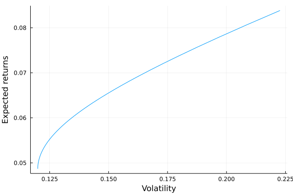

## Optimal portfolio: the Markowitz QP formulation

We have two equivalent optimization problems:

- Maximizing the expected return of the portfolio under a volatility constraint ($\sigma$-problem):

$\begin{equation*}
\begin{aligned}
& \text{max}
&& \mu (x)
&&& {\text{u.c.}}
&&&& \sigma(x) \leq \sigma^* \\
\end{aligned}
\end{equation*}$

- Or minimizing the volatility of the portfolio under a return constraint ($\mu$-problem):

$\begin{equation*}
\begin{aligned}
& \text{min}
&& \sigma(x)
&&& {\text{u.c.}}
&&&& \mu(x) \geq \mu^*\\
\end{aligned}
\end{equation*}$

Markowitz transforms the two original non-linear optimization problems into a quadratric optimization problem:

$\begin{equation*}
\begin{aligned}
& x^*(\phi) = 
& & {\text{arg max}}  x^T \mu - \frac{\phi}{2}x^T \Sigma x\\
& \text{u.c.}
& & 1^T_n x = 1 \\
\end{aligned}
\end{equation*}$

where $\phi$ is a risk-aversion parameter:

- if $\phi = 0$ we have $\mu(x^*(0)) = \mu^+$ (ie. the optimized portfolio is the one that maximizes the expected returns)

- if $\phi = \infty$, the optimization problem becomes:

$\begin{equation*}
\begin{aligned}
& x^*(\infty) = 
& & {\text{arg min}}  \frac{1}{2}x^T \Sigma x\\
& \text{u.c.}
& & 1^T_n x = 1 \\
\end{aligned}
\end{equation*}$

We have, in this case, $\sigma(x^*(\infty)) = \sigma^-$. This is the minimum variance (or MV) portfolio (ie. the portfolio that minimizes the volatility).

Let's implement this $\phi$-problem formulation:

```julia
using JuMP, COSMO # Packages for optimization

function optimal_portfolio_markowitz(μ::Vector{Float64}, Σ::Matrix, ϕ::Float64)::Vector{Float64}
    n = length(μ) # number of assets
    model = JuMP.Model(COSMO.Optimizer) # we load COSMO solver
    @variable(model, x[1:n]) # the optimal weights we want to find
    @objective(model, Max, x' * μ - ϕ/2 * x' * Σ * x) # the markowitz formulation
    @constraint(model, ones(n)' * x == 1) # the only constraint we got for now
    JuMP.optimize!(model) # solve the model
    x_opt = JuMP.value.(x) # obtain the optimal weights
    return x_opt
end

μ = [0.05, 0.06, 0.08, 0.06] # same expected returns

Σ = [
    0.0225  0.003  0.015   0.0225
    0.003   0.04   0.035   0.024
    0.015   0.035  0.0625  0.06
    0.0225  0.024  0.06    0.09
] # the covariance matrix
```

Let's test with a value of $\phi = 0.2$:
```julia
x_opt = optimal_portfolio_markowitz(μ, Σ, 0.2)
```
We get:
```
 -0.33746115671814536
 -3.034877788599787
  8.06224201103845
 -3.6899030657205145
```
And we have the following expected returns
```julia
portf = Portfolio(μ = μ, σ = σ, C = C, Σ = Σ, x = x_opt)
returns = get_portfolio_return(portf)
```
```
0.2246194517879506
```

 and volatility:
```julia
volatility = get_portfolio_volatility(portf)
```

```
0.9456799462474924
```

Let's simulate simulate this for several $\phi$ values and plot the resulting efficient frontier:
```julia
phis = [i for i in 1:0.1:500]

returns = zeros(length(phis))
volatility = zeros(length(phis))
for i in 1:length(phis)
    x = optimal_portfolio_markowitz(μ, Σ, phis[i])
    portf = Portfolio(μ = μ, σ = σ, C = C, Σ = Σ, x = x)
    returns[i] = get_portfolio_return(portf)
    volatility[i] = get_portfolio_volatility(portf)
end


plot(volatility, returns, seriestype = :line, label = "",
    xlabel = "Volatility", ylabel = "Expected returns")
```



## Solving $\mu-$ and $\gamma-$ problems

Solving the $\mu$-problem or the $\sigma$-problem is equivalent to finding the optimal value of $\phi$ such that:

$\mu(x^*(\phi))=\mu^*$ 

or:

$\sigma(x^*(\phi))=\sigma^*$

We know that:

- the functions $\mu(x^*(\phi))$ and $\sigma(x^*(\phi))$ are decreasing with respect to $\phi$
- the functions $\mu(x^*(\phi))$ and $\sigma(x^*(\phi))$ are bounded

Then, we can find the optimal value of $\phi$ (ie. the value of $\phi$ to attain a specific target of $\sigma^*$ or $\mu^*$) using the bisection algorithm (Newton-Raphson algorithm).
