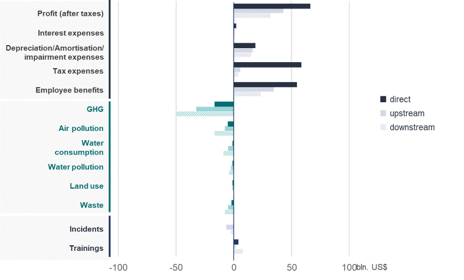
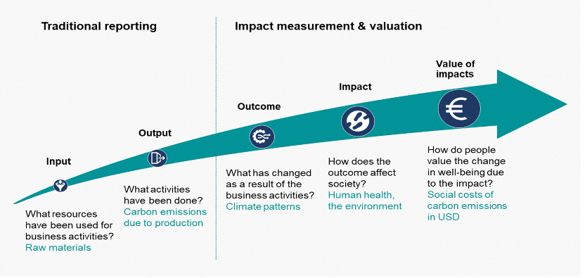
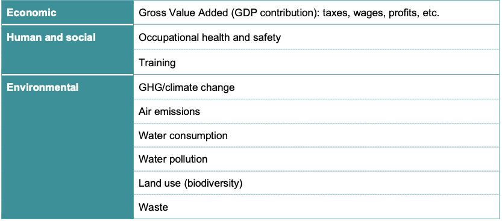
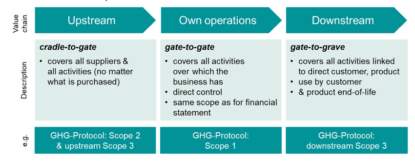

# Julia for Sustainable Finance

The objective of this website is to explain how to conduct externalities valuation with Julia. The entire methodology comes from the Value Balancing Alliance. All credits for the methodology goes to the Value Balancing Alliance. The author of this website only added the programming with Julia components.

This page is a summarized version of the General Paper (2021) published by the Value Balancing Alliance.

The aim of the methodology proposed by the Value Balancing Alliance is:

- To move forward traditional ESG assessment

- Standardize the ESG assessment 

- Assessing positive and negative impacts of corporate activities on the environment and society (measure the value to society)

Source: Value Balancing Alliance, General Paper 2021

## Performing Monetary ESG Valuation

- Traditional ESG reporting stops at the quantification of impacts, such as tonnes of GHG emissions emitted or reported safety incidents

- Assigning a monetary value to these impacts allows for understanding the scale of the consequences of these impacts

- Monetary valuation also enables direct comparison of different impact areas

- Monetary valuation enables to price externalities of business activities

- Specific valuation methods will be discussed for each ESG issues covered

Source: Value Balancing Alliance, General Paper 2021

## ESG Scoping 

We discuss here briefly the scope of the ESG valuation methodology proposed by the Value Balancing Alliance.

### ESG Issues

- In this first version of the methodology proposed by the Value Balancing Alliance, three main dimensions are covered as externalities or social values of business:

    - Economic 

    - Environmental 

    - Human and Social

- Some areas, such as impacts and pricing of GHG emissions and climate change are well established. Other approaches are much less advanced and subject to ongoing debate.

Source: Value Balancing Alliance, General Paper 2021

### Value Chain of Impacts

- Influence of a company goes far beyond the boundaries over which it exercises financial or operational control 

- A meaningful assessment of the relationships between companies and nature and companies and society needs to take upstream and downstream effects into account

Source: Value Balancing Alliance, General Paper 2021

