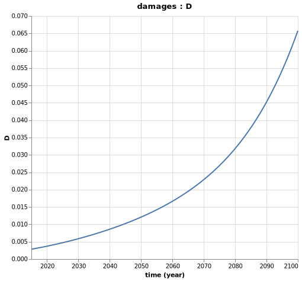

## Binding All Components Together

We can now use `Mimi`to bind the `grosseconomy`, the `emissions`, the `climate` and the `damages` components together, in order to solve for the emissions level of the global economy over time and the resulting damages.

```julia
# STEP 2: CONSTRUCT A MODEL BY BINDING BOTH COMPONENTS 

# if anay variables of one component are parameters for another, connect_param! is
# used to couple the two

function construct_model(;marginal = false)
    m = Model()

    set_dimension!(m, :time, collect(2015:1:2100))

    # Order matters here, if the emissions component defined first, error
    add_comp!(m, grosseconomy)
    add_comp!(m, emissions)
    add_comp!(m, climate)
    add_comp!(m, damages)

    """
    update_param! used to assign values each component parameter 
    with an external connection to an unshared model param 
    """
    # Update parameters for the grosseconomy component
    update_param!(m, :grosseconomy, :L, [(1. + 0.003)^t * 6.404 for t in 1:86])
    update_param!(m, :grosseconomy, :TFP, [(1 + 0.01)^t * 3.57 for t in 1:86])
    update_param!(m, :grosseconomy, :s, ones(86) .* 0.22)
    update_param!(m, :grosseconomy, :δ, 0.1)
    update_param!(m, :grosseconomy, :k0, 130.)
    update_param!(m, :grosseconomy, :β, 0.3)

    # update parameters for the emissions component 
    update_param!(m, :emissions, :ω, [(1. - 0.002)^t * 0.07 for t in 1:86])
    
    if marginal # we'll see later the use of this
        pulse = 1/1e10 # units of emissions are Gt then we convert 1 ton of pulse in Gt 
        update_param!(m, :emissions, :ϵ, [(1. - 0.002)^t * (7.92 + pulse) for t in 1:86])
    else
        update_param!(m, :emissions, :ϵ, [(1. - 0.002)^t * 7.92 for t in 1:86])
    end

    # update parameters for the climate component 
    update_param!(m, :climate, :CO2_AT_0, 3120)
    update_param!(m, :climate, :CO2_UP_0, 5628.8)
    update_param!(m, :climate, :CO2_LO_0, 36706.7)
    update_param!(m, :climate, :F_0, 2.30)
    update_param!(m, :climate, :FEX_0, 0.28)
    update_param!(m, :climate, :T_AT_0, 1.0)
    update_param!(m, :climate, :T_LO_0, 0.0068)

    update_param!(m, :climate, :CO2_AT_PRE, 2156.2)
    update_param!(m, :climate, :CO2_LO_PRE, 36670.0)
    update_param!(m, :climate, :CO2_UP_PRE, 4950.5)
    update_param!(m, :climate, :F2CO2, 3.8)
    update_param!(m, :climate, :fex, 0.005)
    update_param!(m, :climate, :ϕ_11, 0.9817)
    update_param!(m, :climate, :ϕ_12, 0.0183)
    update_param!(m, :climate, :ϕ_21, 0.0080)
    update_param!(m, :climate, :ϕ_22, 0.9915)
    update_param!(m, :climate, :ϕ_23, 0.0005)
    update_param!(m, :climate, :ϕ_32, 0.0001)
    update_param!(m, :climate, :ϕ_33, 0.9999)
    update_param!(m, :climate, :t_1, 0.027)
    update_param!(m, :climate, :t_2, 0.018)
    update_param!(m, :climate, :t_3, 0.005)
    update_param!(m, :climate, :S, 3)

    # update parameters for damages function 

    update_param!(m, :damages, :η₁, 0)
    update_param!(m, :damages, :η₂, 0.00284)
    update_param!(m, :damages, :η₃, 0.000005)

    # connect parameters for the emissions component 
    connect_param!(m, :emissions, :Y, :grosseconomy, :Y)

    # connect parameters for the climate component 
    connect_param!(m, :climate, :E, :emissions, :E)

    # connect parameters for the damages component
    connect_param!(m, :damages, :T_AT, :climate, :T_AT)
    connect_param!(m, :damages, :Y, :grosseconomy, :Y)

    return m
end
```


Now, we can run the model and examine the results:
```julia 
m = construct_model()
run(m)

# Check model resutls 
getdataframe(m, :emissions, :E)
```

And we can vizualize the results via plotting and explorer:
```julia
# Plot model results
Mimi.plot(m, :grosseconomy, :Y)
Mimi.plot(m, :emissions, :E)
Mimi.plot(m, :climate, :T_AT)
Mimi.plot(m, :damages, :D)
```
So, what does our simplistic model tell us?

First, the output should continue to grow according to our hypothesis, up to hundreds of trillion USD! 


Second, due to our assumptions on the carbon intensity and energy intensity evolutions, alongside the economic growth, the emissions should grow such as:


Due to these emissions, the atmospheric temperature should increase by 3.5°C by the end of the century.


Which could result to up to 6.5% of yearly GDP damages by 2100:




You can also explore interactively all the variables in your model with the following command:
```julia
# Observe all model result graphs in UI
explore(m)
```